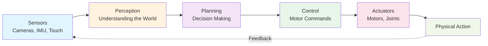

## Introduction

What is Physical AI? It's not science fiction anymore—it's happening right now. Physical AI refers to artificial intelligence systems that exist in robots, drones, and autonomous machines that can perceive, learn, and act in the physical world. Unlike the AI you might use in a chatbot or recommendation system, Physical AI must handle real-world challenges: gravity, friction, unpredictable environments, and the constant need to make split-second decisions with imperfect information.

In this chapter, you'll learn what makes Physical AI special, why it matters, and how it's already changing industries from manufacturing to healthcare. By the end, you'll understand not just what Physical AI is, but *why* building robots that can work alongside humans is one of the biggest engineering challenges of our time.

## Main Content

### What Makes Physical AI Different?

Imagine you ask a software AI to move a coffee cup from one table to another. For a chatbot, this request is meaningless—it can only generate text. But a physical AI robot must actually *do* it. It needs to:

1. **See** the cup using cameras or sensors
2. **Understand** where the cup is in 3D space
3. **Plan** a path for its arm that doesn't spill the coffee
4. **Control** dozens of motors and joints with precision
5. **React** if something unexpected happens (the table shifts, an obstacle appears)

This combination of perception, planning, and control is what makes Physical AI fundamentally different from traditional software AI.

### Real-World Examples

Let's look at three companies pushing Physical AI forward:

**Tesla Bot**: Tesla is developing a humanoid robot designed to perform repetitive, dangerous, or boring tasks in manufacturing. The bot has hands with dexterous fingers, cameras for eyes, and a neural network "brain" trained on Tesla's factory data. The goal? To eventually replace some human workers in assembly lines, freeing people for more creative work.

**Boston Dynamics**: Known for incredible viral videos, Boston Dynamics builds quadruped (four-legged) robots like Spot and bipedal (two-legged) robots like Atlas. Spot can climb stairs, open doors, and navigate complex terrain. These robots are already being tested in real warehouses and construction sites.

**Unitree Go**: A Chinese competitor offering legged robots at a fraction of the cost of Boston Dynamics. These robots are more affordable and accessible to researchers and smaller companies exploring robotics applications.

### Why Humanoid Form Factor?

You might wonder: *Why make robots look like humans?* There are several good reasons:

- **Compatibility**: Human environments (stairs, doorknobs, chairs) are designed for humanoid bodies
- **Intuitiveness**: Humans instinctively understand how a humanoid robot might interact with objects
- **Versatility**: Two arms, two legs, and a torso provide flexibility for many different tasks
- **Research**: Understanding humanoid locomotion teaches us about physics, biology, and control theory

That said, humanoids aren't always the best choice. For moving cargo in warehouses, a quadruped like Spot might be better. The "best" robot depends on the task.

## Diagram

**Figure 1**: The Physical AI Loop — Sensors feed data to perception systems, which inform planning decisions. Planning outputs motor commands to actuators, which produce physical action. Feedback loops from sensors keep the cycle running.

## Real-World Examples (Sidebar)

**Did You Know?**

- Boston Dynamics' Atlas robot can run, jump, and perform backflips—movements that require real-time balance control at speeds a human can't match.
- Tesla's Optimus (Tesla Bot) is designed to eventually cost less than a car, making humanoid robots accessible to small businesses.
- The earliest modern humanoid robot, Honda's ASIMO, was introduced in 2000 and could walk, run, and climb stairs—setting the stage for today's advanced robots.

## Try It!

1. **Watch and Observe**: Find a 2-minute video of Boston Dynamics' Spot or Tesla Bot online. Watch how it moves and list three things the robot must "sense" to do what it's doing.

2. **Think About Humanoids**: Name three everyday objects in your home (besides a chair) that are designed for humanoid bodies. How would a robot access or use them?

3. **Brainstorm Applications**: Think of three jobs in your community (nurse, construction worker, farmer) where a robot could help humans work better. What would the robot need to do?

## Summary

- **Physical AI** combines perception, planning, and control to let robots act in the real world
- **Real robots today** (Tesla Bot, Boston Dynamics Spot, Unitree Go) are already doing useful work
- **Humanoid form factor** is valuable because humans and human environments are designed with humanoid proportions in mind
- **The Physical AI loop** connects sensors, perception, planning, control, and actuators in a continuous feedback cycle

## Exercises

1. **Recall**: Define Physical AI in 2–3 sentences. How does it differ from software AI?
2. **Comprehension**: Name three real robot platforms mentioned in this chapter and one task each can perform.
3. **Analysis**: Why might a company choose a humanoid robot over a wheeled robot for a warehouse? What tradeoffs come with that choice?
4. **Synthesis**: Imagine you're designing a robot to help elderly people in a care facility. Would you choose a humanoid or a different form factor? Explain your reasoning with at least two supporting points.

## Recap

You now understand what Physical AI is and why robots like Tesla Bot and Boston Dynamics Spot are more than cool tech demos—they're solutions to real problems. In the next chapter, we'll dive deeper into humanoid robot anatomy: how their bodies are designed, how many joints they have, and why those design choices matter for what a robot can do.

---

**Next: [Chapter 2: Intro to Humanoid Robots](./chapter-02-intro-to-humanoids.mdx)** — Learn how humanoid bodies are designed and why degrees of freedom matter.
