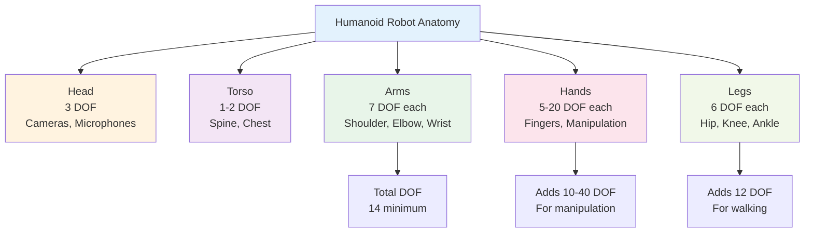

## Introduction

What makes a robot "humanoid"? It's not just having a head and arms. True humanoid design involves careful engineering of proportions, joints, and movements that mirror human anatomy. In this chapter, you'll learn how humanoid robots are structured, what "degrees of freedom" means, and why roboticists continue to build machines that resemble humans—even though it's incredibly complex.

By understanding humanoid anatomy, you'll see why certain robots can do things wheeled robots cannot, and how engineers make tradeoffs between being human-like and being practical.

## Main Content

### Basic Anatomy of Humanoid Robots

A typical humanoid robot has:

1. **Head** — Contains cameras, microphones, and sometimes processing chips
2. **Torso** — The central body with a spine-like structure for flexibility
3. **Two Arms** — Each with shoulders, elbows, wrists, and hands
4. **Two Legs** — Each with hips, knees, ankles, and feet
5. **Hands** — Sometimes with individual finger control; sometimes simplified

Each of these parts is controlled by multiple motors and joints, allowing the robot to move with flexibility and precision.

### Degrees of Freedom (DOF)

**Degrees of freedom** is a term that describes how many independent ways something can move. Think of your own body:

- Your elbow can bend up and down (1 DOF)
- Your shoulder can rotate in multiple directions (3 DOF)
- Your wrist can rotate, tilt, and twist (3 DOF)

Add these up, and a human arm has roughly 7 degrees of freedom. This high DOF is why we can perform complex tasks like threading a needle or tying shoelaces.

Robots need enough DOF to be useful. Tesla Bot's arms each have 7 DOF, similar to humans. Boston Dynamics' Atlas has even more flexibility across its entire body. However, more DOF means more motors, more complex control systems, and higher cost.

### Why Humanoid Proportions?

Humans didn't design our bodies for efficiency in a lab—evolution shaped our proportions for survival in nature. But those proportions also happen to be *very good* for manipulating objects and navigating human environments:

- **Arm length**: Reaches across a desk or workbench
- **Leg length**: Climbs stairs designed for human stride
- **Hand structure**: Manipulates doorknobs, buttons, and tools
- **Balance**: Two-legged stance is less stable than four legs but frees the arms

When you design a robot to work in human spaces (homes, offices, factories), humanoid proportions make sense.

### Real Humanoid Examples

**Boston Dynamics Atlas**: Stands 5'9" (175 cm) tall, weighs 330 lbs (150 kg), and has 28 actuated joints. Can run, jump, and perform tasks like placing boxes on shelves. The most advanced general-purpose humanoid currently in existence.

**Tesla Optimus (Tesla Bot)**: Planned to be 5'8" (173 cm) tall, weigh 125 lbs (57 kg), and have 40 electromechanical actuators. Designed for manufacturing tasks in Tesla factories. More emphasis on dexterity (hand precision) than Atlas.

**Unitree H1**: A more affordable humanoid at 5'3" (160 cm) tall. Less capable than Atlas but accessible for research and small businesses. Shows that humanoid robotics is moving from cutting-edge research to practical deployment.

## Diagram

**Figure 2**: Humanoid robot degrees of freedom — Each joint adds one or more DOF. A full humanoid body can have 40-50+ total degrees of freedom.

## Did You Know?

- **Human hands** have 27 degrees of freedom—one reason we're so skilled at manipulation. Most humanoid robots have 5-20 in their hands to keep costs manageable.
- **Boston Dynamics' Atlas** can rotate its torso 40 degrees, bend its knees, and distribute weight dynamically. This "active balance" is crucial for walking on uneven terrain.
- **Tesla Bot's design focus**: Dexterity and manipulation. The bot is designed to perform factory assembly tasks, so fine motor control in the hands is prioritized over high-speed movement.

## Try It!

1. **Count Your Own DOF**: Hold your arm out straight. How many independent ways can you move your hand? (Rotate wrist, flex elbow, rotate shoulder, etc.)

2. **Design Trade-offs**: Imagine you're an engineer. Would you build a humanoid robot with 50 DOF or 20 DOF? List pros and cons for each choice.

3. **Compare Form Factors**: Boston Dynamics also makes Spot (a quadruped). What tasks might Spot handle better than a humanoid? What about the reverse?

## Summary

- **Humanoid robots** have heads, torsos, arms, and legs—similar to human anatomy
- **Degrees of freedom** measure how many independent ways a joint can move
- **Human-like proportions** allow robots to work in human-designed environments
- **Real humanoids today** range from Tesla Bot (focused on factory work) to Boston Dynamics' Atlas (advanced general-purpose robot)

## Exercises

1. **Recall**: What are the main body parts of a humanoid robot? List at least four.

2. **Comprehension**: What is a "degree of freedom"? Give one example from your own arm or leg.

3. **Analysis**: Why might a robot designer choose to include 7 DOF in each arm instead of just 3? What problem does the extra DOF solve?

4. **Synthesis**: Compare humanoid robots to wheeled robots. In what environments or tasks would you prefer each form factor, and why?

## Recap

Now you understand how humanoid robots are structured and why engineers borrow from human anatomy. The high number of degrees of freedom enables dexterity and flexibility, but also complexity. In the next chapter, we'll learn what sensors these robots use to perceive their world—the "eyes," "ears," and "touch" of a robot.

---

**Next: [Chapter 3: Sensors Explained](./chapter-03-sensors-explained.mdx)** — Discover how robots sense their environment.
