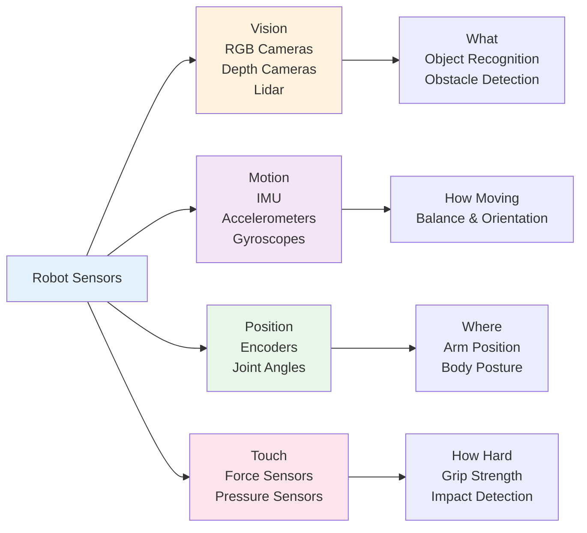

## Introduction

How do robots "see" and "feel" the world? Through sensors—devices that measure physical quantities and convert them into data that a robot's computer can understand. In this chapter, you'll learn about the main types of sensors found in humanoid robots, how they work, and why a robot needs multiple sensors to build a complete picture of its environment.

Sensors are the robot's connection to the physical world. Without them, even the smartest AI is blind, deaf, and numb.

## Main Content

### Types of Sensors

**Cameras (RGB)**
Cameras capture images, just like your phone's camera. A humanoid robot might have cameras in its head (forward-looking) and additional cameras on its wrists or chest for different perspectives. Cameras are great for detailed visual tasks—reading text, recognizing objects, detecting faces. However, cameras struggle in darkness and can be fooled by reflections or camouflage.

**Depth Cameras (RGB-D)**
These cameras add distance information to each pixel. Instead of just knowing "red pixel at position (x,y)," the robot knows "red pixel at position (x,y) and 2 meters away." This depth data is crucial for reaching toward objects and avoiding obstacles. Boston Dynamics' Spot uses depth cameras to navigate stairs safely.

**Lidar (Light Detection and Ranging)**
Lidar shoots laser beams and measures how long they take to bounce back, creating a 3D point cloud of the environment. Lidar works great in darkness, provides accurate distance measurements, and is less fooled by visual tricks. The downside: lidar is slower than cameras and more expensive.

**Inertial Measurement Unit (IMU)**
An IMU contains accelerometers and gyroscopes. Accelerometers measure acceleration (how fast velocity is changing). Gyroscopes measure rotation. Together, they tell a robot how it's moving and tilting. IMUs are crucial for balance—Boston Dynamics' Spot constantly monitors its IMU data to know if it's about to tip over.

**Force/Torque Sensors**
Also called "touch sensors," these measure force and torque (rotational force). In a robot's hand or wrist, a force sensor helps the robot know how hard it's gripping an object, so it can hold an egg without crushing it, or apply enough force to open a door.

**Encoders**
Encoders measure joint angles—they tell a robot how much a motor has rotated. This is crucial for knowing the position of the robot's limbs. Without encoders, a robot wouldn't know where its own arms are!

## Diagram

**Figure 3**: Sensor types and their purposes — Robots combine multiple sensor types to build a complete understanding of themselves and their environment.

## Real-World Examples

**Boston Dynamics Spot**: Spot uses cameras for navigation, lidar for obstacle detection, and a sophisticated IMU system for maintaining balance on uneven terrain. The combination allows Spot to climb stairs, navigate tight spaces, and recover from stumbles—all things that would be impossible with just one sensor type.

**Tesla Bot**: Equipped with cameras for object recognition and manipulation, IMU for balance, and force sensors in the hands for delicate grasping. The vision system is trained on Tesla factory data to recognize manufacturing tasks and part locations.

**Unitree Go**: Uses a lighter array of sensors to keep costs down—primarily cameras and IMU with limited lidar. Still capable of locomotion and basic object manipulation, but less sophisticated environmental sensing than premium robots.

## Did You Know?

- **Humans have more sensors than robots**: Your skin contains millions of touch receptors, your ears have tiny hair cells detecting sound waves, and your eyes have over 100 million light-sensitive cells. Robots today have dozens to thousands of sensors—still far behind biology.

- **IMU Sampling Rates**: A robot's IMU might sample acceleration and rotation thousands of times per second (e.g., 1000 Hz). This high rate is essential for real-time balance control.

- **Sensor Fusion**: Robots rarely trust a single sensor. They combine camera data, IMU data, and encoder data through algorithms (like Kalman filters, which you'll learn about in a later chapter) to get the most accurate picture of reality.

## Try It!

1. **List Your Own Sensors**: Close your eyes for 10 seconds. What senses are still giving you information about your position and movement? (Hint: it's not just touch.)

2. **Sensor Limits**: Imagine it's completely dark. Which robot sensors would still work? Which would fail?

3. **Design Challenge**: You're building a robot to navigate a crowded grocery store. Which sensors would you prioritize, and why?

## Summary

- **Cameras** provide detailed visual information but struggle in darkness
- **Depth cameras and lidar** add distance measurement for obstacle avoidance and reaching
- **IMU sensors** measure acceleration and rotation, crucial for balance
- **Force sensors and encoders** track touch and joint positions
- **Multiple sensors together** give robots a complete understanding of themselves and their world

## Exercises

1. **Recall**: Name four types of sensors used in humanoid robots and what each one measures.

2. **Comprehension**: What is the advantage of a depth camera over a regular RGB camera?

3. **Analysis**: Why might a robot need both cameras and lidar? What does lidar provide that cameras don't?

4. **Synthesis**: Imagine designing a robot to assist a blind person. Which sensors would be most important, and why? What limitations might you face?

## Recap

Sensors are the robot's connection to reality. Without them, even the smartest AI can't perceive or interact with the world. In the next chapter, we'll learn about actuators—the motors and joints that *move* in response to sensor data. Sensors tell a robot what's happening; actuators make things happen.

---

**Next: [Chapter 4: Actuators & Motors](./chapter-04-actuators-motors.mdx)** — Learn how motors and servos bring robots to life.
