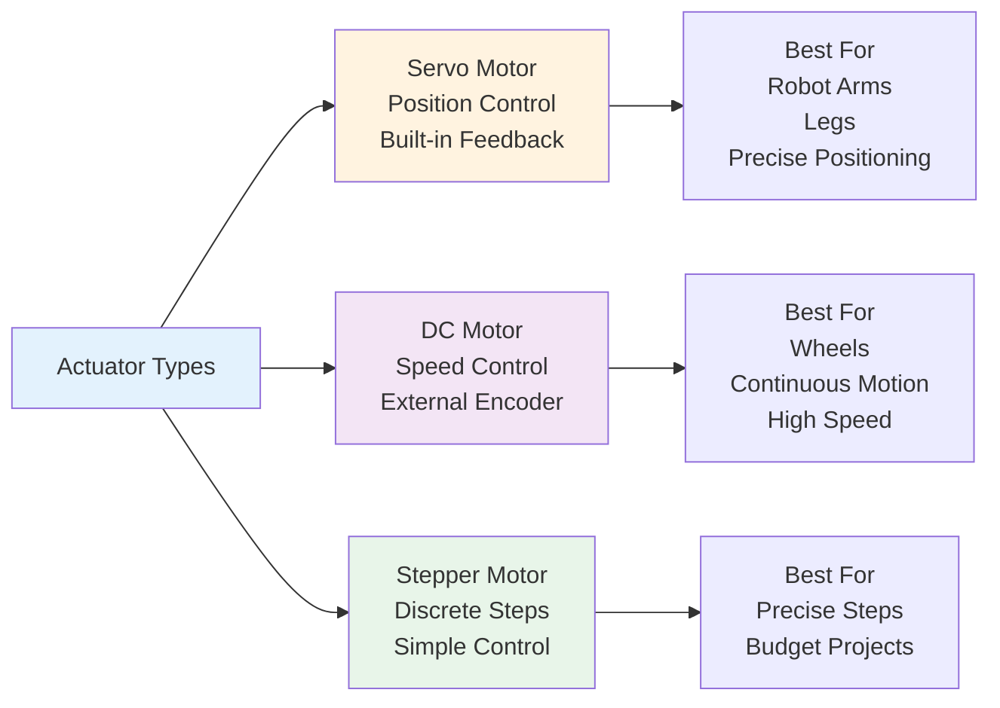

## Introduction

If sensors are a robot's eyes and ears, actuators are its muscles. An actuator is any device that converts electrical signals into physical motion. In this chapter, you'll learn about the main types of actuators used in humanoid robots, how they work, and why choosing the right motor for a job is crucial. You'll also understand *torque*—the "strength" of a motor—which determines whether a robot can lift a coffee cup or move a boulder.

## Main Content

### What's the Difference Between a Motor and an Actuator?

**Motor**: A device that converts electrical power into rotational motion. Motors spin.

**Actuator**: A broader category that includes any device producing movement—motors, hydraulic cylinders, pneumatic actuators, solenoids, etc. In robotics, we often use the terms interchangeably, but technically an actuator is the whole system, and a motor is the core component.

### Common Motor Types

**Servo Motors**
Servo motors are the workhorses of humanoid robotics. A servo combines a motor with gearing and a feedback controller. You send it an electrical signal saying "rotate to position 90 degrees," and the servo adjusts itself to reach that exact position. It also has built-in sensors (encoders) that track its angle. Servo motors provide precise position control, which is essential for robot arm and leg control. Boston Dynamics and Tesla Bot use high-performance servo motors throughout their bodies.

**DC Motors**
Direct Current (DC) motors spin proportionally to the voltage applied—higher voltage, faster spinning. They're simple, cheap, and powerful, but they don't inherently know their position. You need an external encoder to track position. DC motors are often used in wheels or in applications where continuous rotation is needed.

**Stepper Motors**
Stepper motors rotate in precise, fixed steps. You send electrical pulses, and each pulse rotates the motor by a fixed angle (e.g., 1.8 degrees per step). Steppers are very accurate but can be slow and have limited torque. They're used in robotics when precise position control without feedback is needed, though servos are often preferred for humanoids.

### Torque: The Measure of Motor Strength

**Torque** is a measure of rotational force. Think of it as how hard a motor can "twist." Torque is measured in Newton-meters (N⋅m) or in older units, ounce-inches (oz-in).

If a motor has 50 N⋅m of torque and you attach a 1-meter lever arm to it, the motor can lift 50 kilograms. Twice the torque = twice the lifting power (at the same lever length).

Humanoid robots need different torque at different joints:
- **Hip and knee**: High torque needed to support the robot's weight and move legs
- **Shoulder**: High torque to lift arms loaded with objects
- **Wrist and fingers**: Lower torque but high precision for fine manipulation

## Diagram

**Figure 4**: Motor types and their applications — Different motors excel at different tasks. Humanoid robots primarily use servo motors for limbs.

## Real-World Examples

**Tesla Bot Arm Motors**: Tesla uses custom-designed servo motors with high torque for the upper arm and lower torque with more speed in the wrist and fingers. The hand motors are particularly important—Tesla designed them to handle delicate assembly work in factories.

**Boston Dynamics Spot**: Spot's four legs each use multiple servo motors for hip, knee, and ankle joints. Each leg servo is tuned for balance and power distribution. Spot's shoulders also have servo motors for potential manipulation tasks (e.g., opening doors).

**WABOT-1 (Research Platform)**: One of the earliest humanoid robots (1972), WABOT-1 used heavy electric motors and hydraulic actuators. Modern robots like Tesla Bot and Atlas use lighter, more efficient servo motors—a major improvement in weight and energy efficiency.

## Did You Know?

- **Torque vs. Speed Trade-off**: Gear ratios determine the relationship between motor speed and torque. High gear ratios give more torque but slower movement. This is why robot legs move more slowly than robot wheels—the legs need high torque to lift the entire robot.

- **Servo Motor Speeds**: A typical servo motor rotates at 100-300 RPM (rotations per minute). That's much slower than a DC motor, which might spin at thousands of RPM. The difference is that servos prioritize precision and control over raw speed.

- **Cost Difference**: A basic DC motor costs a few dollars. A precision servo motor can cost $50-500 or more, depending on specifications. This is why cheaper humanoid robots use fewer servos or lower-quality motors.

## Try It!

1. **Torque Intuition**: Imagine you're trying to close a heavy door. Is that action more like a servo motor (precise position) or a DC motor (continuous power)? Why?

2. **Motor Selection**: You're designing a robot to pick apples from a tree. What kind of motor would you use in the gripper hand, and why?

3. **Power Efficiency**: A robot's battery is dying. Should it move slowly (low voltage) or fast (high voltage) to extend battery life? Consider torque requirements.

## Summary

- **Actuators** convert electrical signals into physical motion
- **Servo motors** provide precise position control and are used throughout humanoid robots
- **DC motors** provide continuous, powerful rotation and are used in wheels
- **Stepper motors** offer discrete, precise steps for special applications
- **Torque** measures rotational force and determines how much weight a motor can lift or move

## Exercises

1. **Recall**: What is the main difference between a servo motor and a DC motor?

2. **Comprehension**: Explain torque in simple terms. If a motor has twice the torque, what can it do differently?

3. **Analysis**: Why do humanoid robot legs use servo motors instead of simpler DC motors?

4. **Synthesis**: You're building a robot to perform surgery (requiring extreme precision) or to move cargo (requiring power). How would your motor choices differ?

## Recap

Now you understand how sensors and actuators form a complete loop: sensors detect what's happening, the robot's brain decides what to do, and actuators carry out the decision. But there's a crucial middle step—the control system that closes the loop. In the next chapter, you'll learn about feedback and control loops, the mechanism that lets a robot maintain balance and perform repeatable tasks.

---

**Next: [Chapter 5: Basic Control Loops](./chapter-05-basic-control-loops.mdx)** — Learn how feedback keeps robots stable and accurate.
