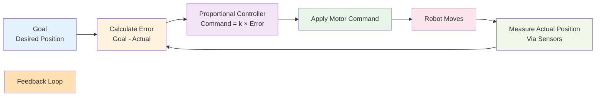

## Introduction

What keeps a robot from falling over? How does a robot's arm reach exactly where you tell it to? The answer is feedback—continuous sensing of what's actually happening, combined with adjustments to get closer to the goal. In this chapter, you'll learn about control loops, the fundamental mechanism that lets robots balance, move smoothly, and recover from disturbances. Without control loops, robots would be helpless against the real world's unpredictability.

## Main Content

### Open-Loop vs. Closed-Loop Control

**Open-Loop Control**
Open-loop means "no feedback." You send a command ("move forward for 2 seconds") and the robot executes it without checking if things are actually happening as planned. Open-loop is simple but fragile—if the robot steps on uneven ground or encounters wind resistance, it won't adjust.

**Closed-Loop Control**
Closed-loop means "feedback." You set a goal ("reach position X"), the robot measures its current position, calculates the error (difference between goal and actual position), and adjusts its motors to reduce that error. The loop repeats continuously—sense, calculate, adjust, repeat.

Humanoid robots rely almost entirely on closed-loop control for stable movement.

### Proportional Control (P-Control)

The simplest form of feedback control is **proportional control**. Here's how it works:

1. **Measure error**: current_position - desired_position = error
2. **Calculate command**: motor_command = k × error (where k is a tuning constant)
3. **Apply command**: set motor power based on calculated value
4. **Repeat**: loop at high frequency (e.g., 1000 times per second)

**Example**: A robot's arm needs to reach a position 10 degrees away from its current angle.
- Error = 10 degrees
- If k = 5, motor_command = 5 × 10 = 50 (full power forward)
- As the arm moves, error shrinks: 5, 4, 3, 2, 1 degree
- Motor power decreases proportionally: 25, 20, 15, 10, 5
- Eventually, error ≈ 0 and arm settles at the target

The key insight: **bigger error → stronger correction**.

### Feedback in Balance

Boston Dynamics' Spot is a masterclass in feedback control for balance. Here's what happens continuously:

1. **IMU measures**: current tilt angle
2. **Goal**: body tilt angle = 0 degrees (vertical)
3. **Error**: current tilt - 0 = error
4. **Hip motors adjust**: lean backward if tipping forward, lean forward if tipping backward
5. **Knee motors adjust**: bend legs to keep center of mass over feet
6. **Repeat**: 1000+ times per second

This rapid feedback loop is why Spot doesn't fall when walking on slopes or recovering from a push.

### Feedback in Reaching

When a robot arm reaches for an object:

1. **Vision estimates**: object position in 3D space
2. **Arm encoders measure**: current joint angles
3. **Calculated error**: difference between current arm position and target object position
4. **Servo motors adjust**: each joint moves to reduce error
5. **Repeat**: until gripper is close enough to grasp

The beauty of closed-loop control is that small errors (robot moved a little wrong, object wasn't exactly where estimated) are continuously corrected.

## Diagram

**Figure 5**: Closed-loop control — The robot continuously measures error and adjusts motors. This loop repeats at high frequency (often 1000+ Hz).

## Real-World Examples

**Boston Dynamics Atlas Balance**: Atlas uses continuous feedback from IMUs and joint encoders to maintain upright posture. When the ground shifts or obstacles appear, the control loop compensates automatically. This is why Atlas can walk on rough terrain without human intervention.

**Tesla Bot Arm Reaching**: When the robot reaches for an object on a shelf, vision estimates the object position, and servo motors adjust based on continuous arm position feedback. The grasping force is also controlled in a feedback loop—sensors measure grip force and adjust motor power to avoid crushing.

**Spot Climbing Stairs**: Climbing requires exceptional balance control. Spot's control loop must account for changing tilt angles, shifting weight distribution, and the need to place feet precisely on stair edges. All of this happens through fast feedback loops operating simultaneously.

## Did You Know?

- **Update Frequency**: Robot control loops often run at 1000 Hz (1000 updates per second), giving them near-instantaneous response to disturbances. That's why robots can recover from small pushes but not large ones—the loop can't react faster than physics allows.

- **Tuning the Constant (k)**: Choosing k is an art form. Too small (k=0.1), and the robot moves slowly and won't reach the target. Too large (k=100), and the robot overshoots wildly and oscillates. Engineers spend hours "tuning" k to get smooth, stable behavior.

- **PID Control**: Beyond proportional (P) control, engineers use PID (Proportional-Integral-Derivative) control, which considers not just current error, but accumulated error over time (Integral) and the rate of error change (Derivative). This allows more sophisticated behavior like gentle approach without overshoot.

## Try It!

1. **Experience Feedback**: Stand on one foot and focus on not falling. Notice how your muscles continuously adjust. That's your body's proprioceptive feedback loop!

2. **Manual Control Experiment**: Imagine moving your mouse cursor to a target on screen, but with a 0.5-second delay. How would that feel? That's what open-loop control is like for a robot.

3. **Tuning Intuition**: If a robot arm overshoots its target (moves too far), should you increase or decrease the constant k?

## Summary

- **Closed-loop control** uses feedback to achieve goals with accuracy and robustness
- **Proportional control** adjusts motor power proportional to the measured error
- **Feedback loops** repeat at high frequency (1000+ Hz) for stable, responsive behavior
- **Balance and reaching** both rely on continuous sensing and adjustment
- **Tuning** the control parameters is essential for smooth robot movement

## Exercises

1. **Recall**: What is the difference between open-loop and closed-loop control?

2. **Comprehension**: Explain proportional control in simple terms. What does the constant k represent?

3. **Analysis**: Why is fast feedback (1000 Hz) important for balance control? What might happen if you slowed it to 10 Hz?

4. **Synthesis**: Design a feedback loop to control room temperature. What would you measure, what goal would you set, and how would you adjust heating?

## Recap

You now have a solid foundation in the fundamentals of Physical AI. You understand what Physical AI is, how humanoid robots are built, how they sense the world through sensors, move through actuators, and maintain stability through control loops. This five-chapter foundation is essential for everything that follows.

In Module 2, we'll dive deeper into sensors and perception—learning how robots build a detailed 3D understanding of their environment and make decisions based on that information.

---

**Module 1 Complete!** You've mastered the fundamentals. Ready to dive into **Module 2: Sensors & Perception**?

**Next: [Chapter 6: IMU Sensors & Orientation](../module-02-sensors-perception/chapter-06-imu-sensors-orientation.mdx)** — Learn how robots track their orientation in 3D space.
