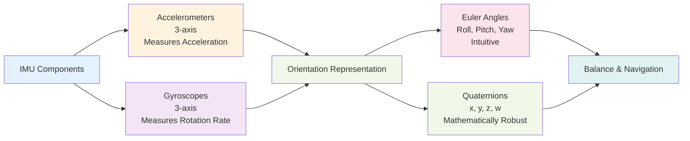

## Introduction

An Inertial Measurement Unit (IMU) is a cluster of sensors measuring acceleration and rotation. Think of it as your inner ear—it tells you which way is up, whether you're spinning, and how fast you're accelerating. In this chapter, you'll learn how IMUs work, how robots use IMU data to maintain balance, and why getting orientation right is foundational for everything else a robot does. You'll also encounter two ways to represent 3D orientation: Euler angles and quaternions. Don't worry—we'll keep it intuitive.

## Main Content

### Accelerometers: Measuring Acceleration

An accelerometer measures how quickly velocity is changing. It has tiny proof masses—small weights suspended by springs. When the device accelerates, inertia pushes the masses, and the spring displacement tells you the acceleration.

**Key insight**: Accelerometers measure *acceleration* relative to the sensor itself, not relative to the world. If you're standing still on Earth, an accelerometer reads ~9.8 m/s² pointing downward (Earth's gravity). If you're in free fall, it reads ~0. This is actually useful—it lets robots detect orientation relative to gravity.

A three-axis accelerometer (one for each dimension) can tell a robot: "You're tilted 30 degrees forward" by measuring the gravity vector direction.

### Gyroscopes: Measuring Rotation

A gyroscope measures angular velocity—how fast something is spinning. In a humanoid robot, gyros tell you rotation rates around three axes:
- **Pitch**: tipping forward/backward
- **Roll**: tilting left/right
- **Yaw**: spinning left/right

Gyros are excellent for tracking fast rotations but "drift" over time—they accumulate error. That's why robots fuse gyro data with accelerometer data (we'll see this in the next chapter on sensor fusion).

### Representing Orientation: Euler Angles

One way to represent 3D orientation is **Euler angles**—three numbers (roll, pitch, yaw) representing rotation around three axes:

- **Roll**: rotation around the forward-backward axis (X-axis)
- **Pitch**: rotation around the left-right axis (Y-axis)
- **Yaw**: rotation around the vertical axis (Z-axis)

Euler angles are intuitive for humans. If I say "the robot is tilted 45 degrees forward (pitch) and 10 degrees right (roll)," you can visualize that.

However, Euler angles have a quirk called "gimbal lock"—in certain orientations, you lose one degree of freedom. This complicates control algorithms.

### Representing Orientation: Quaternions

**Quaternions** are an alternative way to represent 3D orientation using four numbers (x, y, z, w) instead of three. They avoid gimbal lock and are more mathematically convenient for rotation calculations.

Quaternions are less intuitive than Euler angles, but they're the standard in robotics software because they're computationally efficient and mathematically clean. You don't need to understand the math—just know that when you see quaternion values in a robot's firmware, it's a numerically robust way to track orientation.

### IMU for Balance

Boston Dynamics' Spot continuously monitors its IMU to maintain balance:

1. **Accelerometers** detect the gravity vector → tells Spot which way is down
2. **Gyroscopes** measure rotation rates → tells Spot if it's starting to tip
3. **Control loop** (from Chapter 5) adjusts leg motors to keep center of mass over feet
4. **Repeat** 1000 times per second

If Spot is pushed, the IMU detects acceleration, the control loop reacts, and Spot recovers. This is why Spot can stay upright on slopes.

## Diagram

**Figure 6**: IMU components and orientation representation — Accelerometers and gyroscopes feed into orientation algorithms that produce either Euler angles or quaternions.

## Real-World Examples

**Boston Dynamics Spot**: Spot's advanced balance system uses high-quality IMU data at high update rates (1000+ Hz). The IMU sensors are processed in real-time control loops that adjust all four legs independently to maintain stability on terrain ranging from flat ground to steep hills.

**Tesla Bot Factory Deployment**: In a cluttered factory environment, Tesla Bot uses IMU data not just for balance but for task execution. When picking up an object, the robot's IMU helps detect sudden changes in weight distribution (e.g., losing grip), triggering corrective actions.

**Early Humanoid Robots (WABOT-1)**: Older humanoid robots lacked sophisticated IMU integration. As a result, they couldn't handle uneven terrain or quick balance corrections. Modern robots' robustness comes largely from better IMU sensors and faster processing.

## Did You Know?

- **Smartphone IMUs**: Your phone has an accelerometer and gyroscope too! That's how it knows which way is up when you rotate it, and how motion-sensing games work.

- **IMU Noise**: Consumer-grade IMU sensors are noisy—they drift and jitter. Professional robot IMUs cost hundreds of dollars because they're more stable. This is why Boston Dynamics robots are expensive—component quality matters.

- **Rate of Rotation**: Gyroscopes measure rotation speed in degrees per second. A fast spin might be 360 degrees per second. Slow head turn might be 10 degrees per second. Control systems use these measurements to anticipate and react to motion.

## Try It!

1. **Acceleration Sensation**: Jump up and down. Notice the sensation at the moment you leave the ground and land? Your inner ear accelerometers are firing!

2. **Gyroscope Test**: Spin in a circle with your eyes closed. Even without seeing, you can sense your rotation speed and direction. That's your biological gyroscopes.

3. **Orientation Puzzle**: Imagine a robot tilted 30 degrees forward and 20 degrees left. Can you describe that with Euler angles? With quaternions (you might guess the pattern)?

## Summary

- **Accelerometers** measure acceleration in three dimensions, including gravity
- **Gyroscopes** measure rotation rates around three axes
- **Euler angles** (roll, pitch, yaw) provide an intuitive representation of orientation
- **Quaternions** provide a mathematically robust alternative, avoiding gimbal lock
- **IMU data** is fused with other sensors for accurate, drift-free orientation

## Exercises

1. **Recall**: Name the two main components of an IMU and what each measures.

2. **Comprehension**: What is gimbal lock, and why do engineers sometimes use quaternions instead of Euler angles?

3. **Analysis**: Why is IMU sensor quality important for balance control? What problems might arise with a cheap, noisy IMU?

4. **Synthesis**: Design an IMU-based system to detect if a robot has fallen. What sensor readings would indicate a fall?

## Recap

IMU sensors are your robot's inner ear—they track orientation and motion in 3D space. Combined with vision (Chapter 7) and sensor fusion (Chapter 8), IMU data gives robots a complete understanding of themselves and their surroundings. Let's move on to vision systems.

---

**Next: [Chapter 7: Vision & Cameras](./chapter-07-vision-cameras.mdx)** — Learn how robots see and recognize objects.
