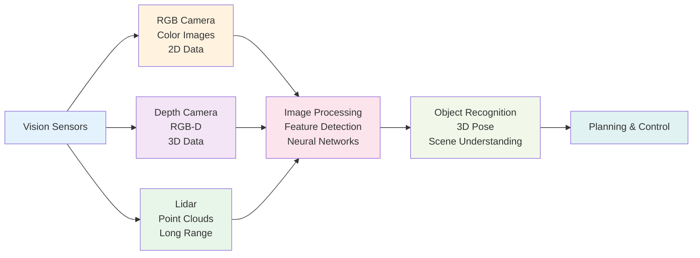

## Introduction

Vision is arguably the richest source of information a robot can access. A camera captures detailed images of the world—colors, textures, edges, faces. In this chapter, you'll learn about different types of cameras used in humanoid robots (RGB cameras, depth cameras, lidar), how they capture information, and how robots extract meaning from raw image data. You'll also encounter concepts like point clouds and object recognition, which transform pixels into understanding.

## Main Content

### RGB Cameras

An RGB camera works like your smartphone camera—it captures red, green, and blue color information for each pixel, creating a colorful 2D image. Humanoid robots often have multiple RGB cameras (forward-facing, on wrists, sometimes on chest) for different perspectives.

Advantages of RGB cameras:
- Rich color information useful for object recognition
- High resolution (millions of pixels)
- Fast readout speed
- Cheap and lightweight

Disadvantages:
- No distance information (2D only)
- Struggles in low light
- Vulnerable to reflections and visual tricks

### Depth Cameras

A **depth camera** (also called RGB-D, for RGB + Depth) captures both color and distance information. These cameras use one of two technologies:

**Structured Light**: Projects a known pattern onto the scene and measures the distortion. Fast and accurate but requires sufficient light.

**Time-of-Flight**: Measures how long light takes to bounce back from objects. Works better in darkness but can be noisier.

Advantages of depth cameras:
- Complete 3D information for each pixel
- Excellent for obstacle avoidance and reaching
- Works reasonably in dim light

Disadvantages:
- Shorter range (typically 1-3 meters)
- Struggles outdoors with sunlight interference

Boston Dynamics' Spot uses depth cameras as a primary navigation sensor. The 3D data allows Spot to detect stairs, measure distances to obstacles, and plan safe footholds.

### Lidar (Light Detection and Ranging)

Lidar is the premium option for environmental perception. It works by:

1. Firing thousands of laser beams
2. Measuring how long each beam takes to bounce back
3. Calculating the 3D position of objects
4. Creating a "point cloud"—a 3D collection of distance measurements

A **point cloud** is essentially a 3D scatter plot of measured points. Software can analyze this point cloud to extract walls, obstacles, flat surfaces, etc.

Advantages of lidar:
- Works in darkness
- Excellent range (10-100+ meters depending on model)
- Very accurate distance measurements
- Robust to visual tricks and reflections

Disadvantages:
- Expensive ($500-$10,000+ for quality lidar)
- Slower update rate than cameras
- Can struggle with transparent or absorptive materials (glass, fabric)

### Object Recognition

Once a robot has camera images, how does it know what it's looking at? Through **computer vision**—algorithms that analyze pixel patterns to recognize objects, faces, text, and scenes.

Traditional approach: **Feature extraction** — algorithms detect edges, corners, and textures, then match them against known patterns. Fast but limited.

Modern approach: **Deep learning** — neural networks trained on millions of labeled images can recognize objects with high accuracy. This is how Tesla Bot recognizes factory parts, assembly jigs, and obstacles.

### Visual Processing Pipeline

Here's a typical flow:

```
Raw Image from Camera
  ↓
Preprocessing (resize, color correction)
  ↓
Feature Detection or Neural Network
  ↓
Object Recognition / Scene Understanding
  ↓
3D Pose Estimation
  ↓
Decision Making & Motor Commands
```

Boston Dynamics' navigation system continuously runs this pipeline on lidar data (creating point clouds) and camera data (creating object recognition), fusing both into a rich environmental model.

## Diagram



**Figure 7**: Vision pipeline — Raw sensor data flows through processing stages to produce actionable scene understanding.

## Real-World Examples

**Boston Dynamics Spot Navigation**: Spot combines lidar (for long-range mapping), depth cameras (for precise obstacle detection), and RGB cameras (for object recognition). This multi-sensor approach lets Spot navigate unknown environments safely, detecting and avoiding obstacles in real-time.

**Tesla Bot Assembly**: Tesla Bot uses RGB cameras trained on thousands of images from Tesla factories to recognize assembly fixtures, components, and work surfaces. The vision system helps the robot understand what task to perform and where to reach.

**Unitree Go Vision**: Uses primarily RGB cameras with IMU sensors for lower-cost operation. Less sophisticated environmental perception than Spot, but sufficient for outdoor walking and basic obstacle avoidance on known routes.

## Did You Know?

- **Human Vision Range**: Humans can focus on objects roughly 10 cm to infinity. Depth cameras typically work 0.5-3 meters. Lidar extends this to 50+ meters. Different tools for different tasks.

- **Neural Network Training**: Tesla's computer vision models are trained on real factory video footage. Initially, the robot might misidentify objects, but with retraining on corrected labels, accuracy improves continuously.

- **Processing Power**: Real-time vision processing is computationally expensive. Spot and Atlas have powerful on-board computers and GPUs (graphics processors specialized for vision algorithms). Cheaper robots might process vision less frequently or with lower resolution.

## Try It!

1. **Camera Experiment**: Take a photo of an object with your phone. Then close your eyes and try to describe that object from memory. Vision algorithms face a similar challenge—converting 2D pixels to 3D understanding.

2. **Depth Intuition**: Hold up two fingers at different distances. Your eyes judge depth by comparing images from two viewpoints (stereopsis). Depth cameras do something similar with either structured light or time-of-flight.

3. **Lidar Visualization**: Imagine scanning a room with a laser. What 3D data would you collect about the room's layout?

## Summary

- **RGB cameras** provide rich color information but lack depth
- **Depth cameras** add 3D distance data for short-range perception
- **Lidar** provides long-range, accurate 3D mapping but is expensive
- **Object recognition** uses feature extraction or deep learning to interpret images
- **Vision pipelines** integrate multiple sensors for robust scene understanding

## Exercises

1. **Recall**: Name three types of vision sensors and what each one measures.

2. **Comprehension**: Explain the difference between RGB and depth cameras. When would you use each?

3. **Analysis**: Why does Spot use multiple vision sensors (lidar, depth, RGB) instead of just one?

4. **Synthesis**: Design a vision system for a robot that must navigate a dark warehouse. Which sensors would you prioritize?

## Recap

Vision gives robots their richest perception of the world. Combined with IMU sensors (Chapter 6), vision enables robots to understand their environment in 3D. But raw data from multiple sensors can be confusing and noisy. In the next chapter, you'll learn how robots fuse data from multiple sensors to build a coherent, accurate model of reality.

---

**Next: [Chapter 8: Sensor Fusion & State Estimation](./chapter-08-sensor-fusion-state-estimation.mdx)** — Learn how robots combine multiple sensors for accuracy.
