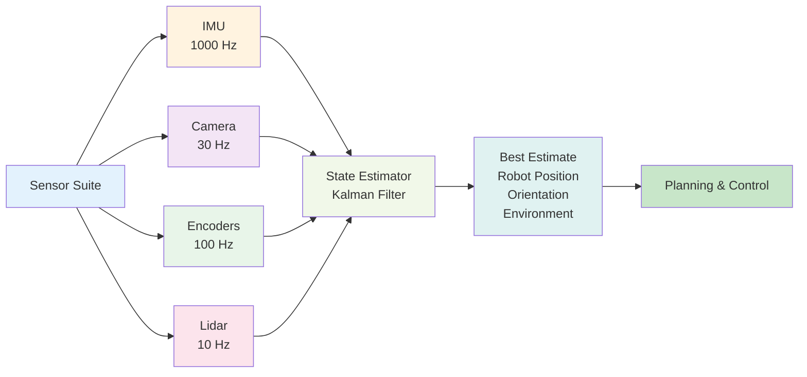

## Introduction

Imagine you're trying to locate your friend in a crowded room. One person says "I saw them near the entrance." Another says "I thought they went left." A third says "I'm pretty sure they're by the snacks." You probably wouldn't trust any single report—you'd combine all three perspectives, weighing each person's reliability, and form your best guess about where your friend actually is.

This is **sensor fusion**—the art of combining multiple sensor measurements (each with its own noise and uncertainty) to estimate the true state of reality. In this chapter, you'll learn how robots do this, including the famous **Kalman filter**, a mathematical tool that's been around since the 1960s and is used in everything from spacecraft to humanoid robots.

## Main Content

### Why Multiple Sensors?

Each sensor type has strengths and weaknesses:

- **Camera**: Rich details, vulnerable to lighting and reflections
- **Lidar**: Accurate distance, struggles with reflective surfaces
- **IMU**: Fast response, drifts over time
- **Encoders**: Know joint positions, don't know world position

By combining these sensors, a robot compensates for individual weaknesses.

**Example**: A robot's arm reaching for an object.
- Vision estimates object position: (0.50m, 0.30m, 0.40m) — but might be slightly off
- Encoder knows joint angles: (45°, 60°, 30°) — accurately but only know arm configuration
- Combined estimation: Use encoders to compute arm position, use vision for target, and fuse both to compute optimal reach trajectory

### The Concept of State Estimation

**State** in robotics means "everything you need to know about the system to predict its future behavior." For a humanoid robot, state might include:

- Position in the world (x, y, z)
- Orientation (roll, pitch, yaw or quaternion)
- Linear velocity (moving forward, backward, up, down)
- Angular velocity (rotating around axes)
- Joint angles and velocities
- Detected object positions

Each sensor provides imperfect measurements of this state. A **state estimator** is an algorithm that combines noisy measurements into a best guess of the true state.

### The Kalman Filter (Conceptual)

The **Kalman filter** is a mathematical algorithm that optimally combines measurements with a motion model to estimate true state. Don't worry about the math—here's the intuitive idea:

**Step 1: Predict**
Based on the robot's last known state and its motion commands, predict where it should be now.

**Step 2: Measure**
Take new sensor measurements (camera, lidar, IMU, etc.).

**Step 3: Fuse**
Compare prediction to measurement. If they're close, trust both roughly equally. If measurement disagrees strongly with prediction, decide whether to trust the prediction (maybe sensor is noisy) or the measurement (maybe prediction model is wrong).

**Step 4: Update**
Compute a blended estimate combining prediction and measurement, weighted by their respective uncertainties.

**Step 5: Repeat**
Loop at high frequency (1000+ Hz for robots).

The beauty of the Kalman filter: it automatically learns to trust sensors more when they're accurate and less when they're noisy.

### Example: Tracking Robot Position

Imagine a humanoid robot walking across a room. Its true position is unknown, but several sensors provide clues:

**Camera Tracking** (slow update rate, 30 Hz):
- Estimates position by detecting visual landmarks
- Accurate over long distances, but updates slowly

**IMU + Dead Reckoning** (fast update rate, 1000 Hz):
- Integrates acceleration and rotation from IMU
- Provides fast updates but drifts over time

**Joint Encoders**:
- Know leg configuration but not absolute position

A Kalman filter fuses all three:
- IMU gives fast local updates
- Camera corrects drift with infrequent global measurements
- Encoders constrain leg motion physically
- Result: accurate, smooth position estimate with both fast response and long-term stability

### Real-World Implementation

Boston Dynamics uses sophisticated sensor fusion pipelines. For Spot's locomotion:

1. **IMU fusion** with encoder data → accurate leg position and body tilt
2. **Lidar + camera fusion** → map of environment
3. **Visual odometry** (tracking visual features over time) → position relative to landmarks
4. **Inertial odometry** (integrating IMU acceleration) → short-term position updates
5. **Loop closure** (recognizing revisited places) → correcting long-term drift

All of these streams feed into a unified state estimation system, producing a consistent model of Spot's position, orientation, and surrounding environment.

## Diagram

**Figure 8**: Sensor fusion pipeline — Multiple sensors with different update rates and characteristics feed into a state estimator that produces a unified, accurate estimate.

## Real-World Examples

**Boston Dynamics Spot Locomotion**: Spot fuses IMU, encoders, and vision to maintain accurate locomotion on rough terrain. The multimodal approach allows Spot to handle terrain changes, slips, and dynamic environments without falling.

**Tesla Bot Manipulation**: When reaching for objects, Tesla Bot fuses camera observations of object position with arm encoder feedback. This allows the robot to adjust in real-time if the object is not exactly where the camera estimated.

**Autonomous Vehicles**: Self-driving cars use Kalman filters to fuse lidar, radar, and camera data, combining their strengths and canceling out individual weaknesses. The same principles apply to humanoid robots.

## Did You Know?

- **Kalman Filter History**: Developed by Rudolf Kalman in 1960. Used in Apollo spacecraft navigation to land humans on the moon. Today, it's in your smartphone's GPS, your car's cruise control, and everywhere real-time tracking is needed.

- **Uncertainty Representation**: Kalman filters represent uncertainty as "covariance matrices"—mathematical objects encoding how confident we are about each piece of state. This allows the algorithm to automatically weight trustworthy sensors more heavily.

- **Extensions Beyond Kalman**: Modern robotics also uses Extended Kalman Filters (EKF) for nonlinear systems, Unscented Kalman Filters (UKF) for better nonlinear approximations, and particle filters for multi-modal uncertainty.

## Try It!

1. **Multiple Witnesses**: Ask two friends to estimate your height, weight, or arm span independently. Average their estimates. Compare to actual measurement. This is like sensor fusion!

2. **Measurement Noise**: Measure the same distance five times with different tools (ruler, measuring tape, smartphone app). Notice variation. State estimation deals with this noise.

3. **Integration Drift**: Walk blindfolded in a straight line while someone counts your steps. Open your eyes. You probably drifted. That's like dead reckoning (IMU integration) without vision correction.

## Summary

- **Sensor fusion** combines multiple imperfect measurements into a more accurate estimate
- **State** includes everything a robot needs to know: position, orientation, velocity, etc.
- **The Kalman filter** is the mathematical tool for optimal sensor fusion
- **Prediction + Measurement + Fusion cycle** repeats at high frequency
- **Multi-sensor systems** compensate for individual sensor weaknesses

## Exercises

1. **Recall**: What is state estimation? Give two examples from a humanoid robot.

2. **Comprehension**: Explain the Kalman filter's predict-measure-fuse cycle in simple terms.

3. **Analysis**: A robot's camera says the object is 1.5m away, but its lidar says 1.6m. Why might this happen, and how would a sensor fusion system handle it?

4. **Synthesis**: Design a sensor fusion system for a robot walking on a treadmill (position should remain constant, but the ground moves). What sensors would you use?

## Recap

Sensor fusion transforms raw, noisy measurements into accurate, actionable estimates of robot state. This is the foundation for all robot perception and control. With accurate state estimation, robots can navigate complex environments, manipulate objects, and maintain balance. In the next chapter, we'll focus on the temporal aspect—how robots process sensor data in real-time, handling the challenges of latency, frame rates, and computational limits.

---

**Next: [Chapter 9: Perception in Real-Time](./chapter-09-perception-in-real-time.mdx)** — Learn how robots process information fast enough to stay alive.
