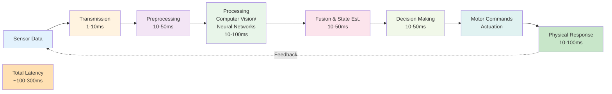

## Introduction

Imagine you're riding a bicycle, but your eyes are closed for 1 second at a time. You'd crash immediately—your brain needs real-time visual feedback to steer. Robots face the same challenge, but even worse: they're surrounded by unpredictable environments (people, objects, terrain) that change constantly. In this chapter, you'll learn about the timing constraints that shape how robots perceive and react to the world. You'll also discover why real-time processing is so hard and how modern robots overcome these challenges.

## Main Content

### Latency: The Enemy of Stability

**Latency** is the time delay between when something happens and when a robot responds.

Examples of latency sources:
- **Sensor processing time**: Camera takes 33ms (at 30 Hz) to capture an image
- **Data transmission**: Moving data from sensor to processor (1-10ms)
- **Software processing**: Vision algorithm runs for 50ms
- **Control computation**: Planning algorithm takes 20ms
- **Motor actuation**: Servo motor accelerates for 10ms
- **Total latency**: 124ms (0.124 seconds)

124 milliseconds might seem fast, but consider: a humanoid robot walking at 1 m/s covers 12.4 cm in that time. If the robot detects an obstacle 124ms after the obstacle actually appears, the robot might have already taken a step into the obstacle.

**The control loop frequency** (how often sensing, processing, and actuation occur) directly impacts stability:

- **1000 Hz (1ms loop)**: State-of-the-art humanoid robots. Can respond to disturbances immediately.
- **100 Hz (10ms loop)**: Modern robots. Can handle most situations but slower reactions.
- **10 Hz (100ms loop)**: Older robots. Stability requires conservative behavior.
- **1 Hz (1000ms loop)**: Not a robot—it's just a frozen sculpture!

### Processing Pipelines and Frame Rates

A typical robot perception pipeline processes data in stages:

```
Camera at 30 Hz
  ↓
USB/network at 1000s Mbps
  ↓
GPU preprocessing (resize, crop) at 30 Hz
  ↓
Deep learning inference (object detection) at 10 Hz (slower!)
  ↓
Pose estimation at 10 Hz
  ↓
Decision-making software at 100 Hz
  ↓
Motor commands at 1000 Hz
```

Notice the bottleneck: camera runs at 30 Hz but neural network inference runs at only 10 Hz. The robot can't make vision-based decisions faster than the neural network can process images.

### Hardware and Computational Limits

Processing power fundamentally limits perception speed:

**GPU (Graphics Processor)**: Great for vision processing (can run thousands of image pixels in parallel). Boston Dynamics' Spot uses powerful NVIDIA GPUs. Can process 30-60 camera frames per second with neural networks.

**CPU (Central Processor)**: General-purpose computation for control algorithms, planning, decision-making. Less parallel than GPUs but handles logic and coordination.

**Specialized Hardware**: Some robots use custom chips optimized for specific tasks (e.g., dedicated neural network accelerators like TPUs or Jetson modules).

Thermal management is a hidden constraint: all this processing generates heat. A robot operating continuously can overheat if cooling isn't adequate. This is why field robots often have active cooling systems.

### Real-Time Constraints

For humanoid robots, "real-time" doesn't mean "as fast as possible"—it means "predictable timing." Consider balance control:

**If the control loop runs at 1000 Hz**:
- Expected update every 1ms
- If a single update is delayed to 1.5ms, the next is on time at 2ms
- Total jitter: ±0.5ms

**If the same loop has unpredictable delays**:
- One update takes 0.5ms, next takes 5ms, next takes 1ms
- Jitter is large, and balance control oscillates or becomes unstable

This is why robot operating systems (ROS) use specialized real-time kernels that guarantee timing.

### Real-World Processing Latency

**Boston Dynamics Spot**:
- Lidar samples at 10 Hz (100ms per scan) → high-resolution mapping every 100ms
- IMU samples at 1000 Hz → balance feedback every 1ms
- Visual odometry at ~30 Hz → position updates every 33ms
- Control loop at 1000 Hz → motor commands every 1ms

The fusion strategy combines fast (IMU, motors) and slow (lidar, vision) sensors, using fast sensors to bridge gaps in slow sensor data.

**Tesla Bot**:
- Cameras at 30 Hz
- Neural network inference at ~10 Hz for object detection
- Control loop at 1000+ Hz
- Prioritizes fast reaction time for balance, slower (but still real-time) processing for manipulation

### Optimization Strategies

Robots optimize perception for real-time operation:

1. **Hierarchical processing**: Fast low-level reflex (balance, obstacle avoidance); slower high-level planning
2. **Asynchronous processing**: Don't wait for all sensors; process them as they arrive
3. **Approximate algorithms**: Use faster but slightly less accurate algorithms (e.g., simplified neural nets)
4. **Edge computing**: Process data on board rather than sending to remote servers
5. **GPU acceleration**: Offload heavy lifting to specialized hardware

## Diagram



**Figure 9**: Perception pipeline latency — Each stage adds delay. Total system latency accumulates, but fast IMU loops and motor commands help maintain stability despite delays.

## Real-World Examples

**Spot on Stairs**: Spot navigates stairs by combining high-frequency balance control (1000 Hz IMU-based loop) with lower-frequency visual planning (lidar at 10 Hz, camera at 30 Hz). The fast loop maintains stability; the slow loop identifies stair edges and plans foot placement.

**Tesla Bot in Factories**: Real factory environments are dynamic—humans work nearby, parts move on conveyors, lighting changes. Tesla Bot must react fast to avoid collisions (microsecond-level reflexes in the motor controller) while performing complex manipulation tasks (millisecond-level perception).

**NVIDIA Isaac Sim**: A simulation platform allowing roboticists to test perception and control algorithms at deterministic frame rates before deploying on real robots. This helps ensure timing requirements are met.

## Did You Know?

- **Human Visual Latency**: Our brains process visual information with ~80ms latency. We compensate through prediction (our brain anticipates where moving objects will be). Robots do this too through state prediction in Kalman filters.

- **Event Cameras**: New sensor technology (neuromorphic cameras) respond to pixel-level brightness changes asynchronously, with microsecond latency. These could revolutionize robot perception in dynamic environments.

- **Soft Real-Time vs. Hard Real-Time**: "Hard real-time" (missing deadline causes catastrophe) vs. "soft real-time" (missing deadline is bad but not catastrophic). Robot balance is hard real-time; object recognition is soft real-time.

## Try It!

1. **Latency Experience**: Play an online video game where you're experiencing network lag. Notice how delayed responses make it hard to control character movement. Robots experience similar challenges.

2. **Visual Processing**: Look at a complex scene (crowd, landscape). How long does it take you to process the full scene? Try to estimate: 100ms? 500ms? 1 second?

3. **Feedback Control**: Try to balance a ruler on your fingertip. Notice your rapid micro-corrections. That's a fast control loop. Now close your eyes—much harder! That's what happens with sensor latency.

## Summary

- **Latency** is the time delay from sensor measurement to motor response
- **Control loop frequency** determines how fast a robot can react (1000 Hz is state-of-the-art)
- **Processing pipelines** have bottlenecks, especially in deep learning inference
- **Real-time constraints** require predictable, not just fast, processing
- **Hierarchical and asynchronous processing** strategies optimize perception for robots

## Exercises

1. **Recall**: What is latency and why does it matter for robot balance?

2. **Comprehension**: Explain the difference between "fast" and "real-time" in robot systems.

3. **Analysis**: A robot's perception loop runs at 30 Hz (33ms per update). If an obstacle appears, how long until the robot can react? What are the implications for walking speed?

4. **Synthesis**: Design a real-time perception system for a robot navigating a crowded hallway. What components must be fast, and what components can be slower?

## Recap

Module 2 has taken you from individual sensors through fusion, all the way to the temporal challenges of real-time perception. A humanoid robot's ability to navigate complex environments depends not just on *what* it senses, but on *how fast* it processes that information.

Now you're ready for Module 3, where you'll learn about locomotion—how robots walk, run, climb, and maintain balance in a dynamic world. All the perception foundations you've learned will enable complex movement behaviors.

---

**Module 2 Complete!** You now understand how robots see, sense, and fuse multiple data sources into accurate models of reality.

**Next: [Chapter 10: Walking Basics & Gaits](../module-03-locomotion/chapter-10-walking-basics-gaits.mdx)** — Learn how robots move through the world.
