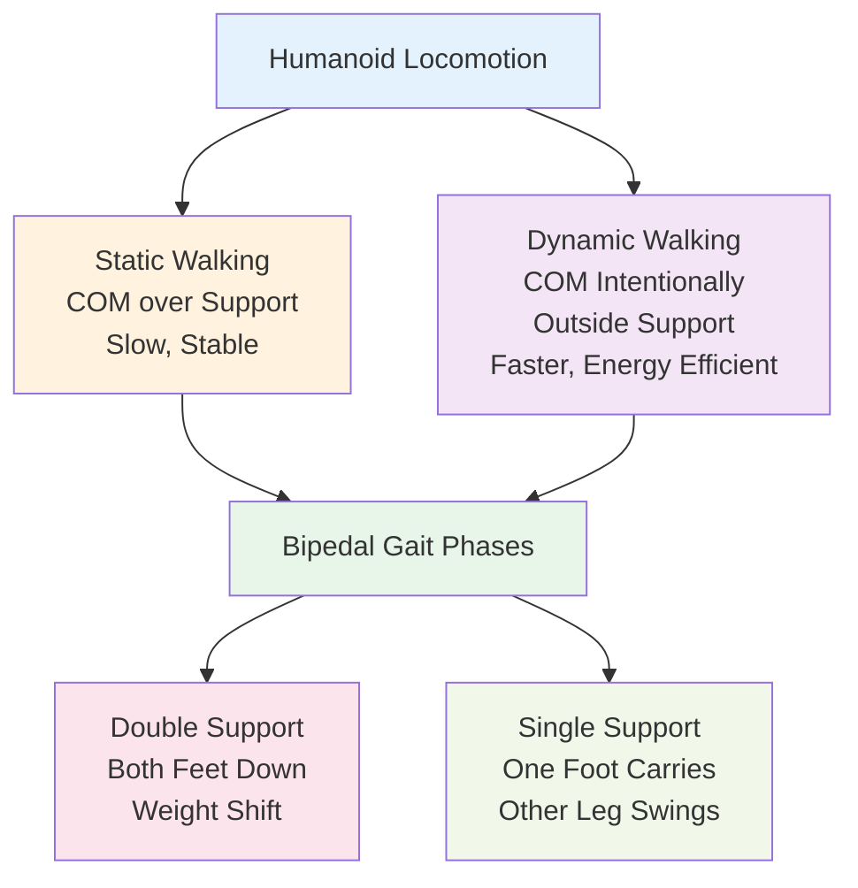

## Introduction

Walking seems simple—humans do it from age 1 without thinking. But for a robot with rigid joints, motors instead of muscles, and a heavy battery pack, walking is deceptively complex. This chapter covers the fundamentals of robot locomotion: how bipedal (two-legged) and quadrupedal (four-legged) robots walk, different gait patterns, and the physics that keeps them from toppling over. You'll see why Boston Dynamics' Spot can climb stairs while simple wheeled robots cannot.

## Main Content

### Static vs. Dynamic Walking

**Static Walking** (or Static Balance):
A robot's center of mass stays within the polygon formed by its support feet at all times. Think of an extremely cautious robot moving slowly, never risking a fall. Static walking is stable but slow and energy-inefficient for humanoids.

Example: Older humanoid robots using static walking could walk at ~0.3 m/s (leisurely stroll) without falling.

**Dynamic Walking** (or Dynamic Balance):
A robot's center of mass intentionally moves outside the support polygon—the robot is technically falling, but catches itself by moving its next foot. This is how humans walk! Dynamic walking enables higher speeds and is more energy-efficient but requires precise timing and control.

Example: Boston Dynamics' Atlas runs at 7+ m/s using dynamic balance.

### Bipedal Gaits (Two Legs)

**Walking Gait** (Used by Humanoid Robots):
- Left foot forward, shift weight to left leg
- Swing right leg forward, place it ahead
- Shift weight to right leg
- Swing left leg forward
- Repeat

Bipedal walking has a "double support phase" where both feet are on the ground (stable but no forward progress) and a "single support phase" where one leg carries the whole body (requires balance but allows forward progress).

**Running Gait**:
- Leaves ground completely between steps
- Both feet airborne simultaneously (no support phase)
- Much faster but requires precise timing

Humanoid robots capable of running (like Boston Dynamics' Atlas) use sophisticated control loops to manage the airborne phase.

### Quadrupedal Gaits (Four Legs)

**Walk Gait**:
- Fronts-left, hind-right, fronts-right, hind-left (staggered pattern)
- Usually 3 feet on ground at any time → very stable
- Good for rough terrain

**Trot Gait**:
- Diagonal pairs move together: front-left + hind-right, then front-right + hind-left
- 2 feet on ground, alternating diagonals
- Faster than walking, still stable

**Gallop Gait**:
- More complex, all four legs off ground sequentially
- Very fast, used by running animals and fast robots

Boston Dynamics' Spot primarily uses a trotting gait for speed while maintaining stability. Spot can accelerate and perform dynamic adjustments.

### Center of Mass and Stability

A robot's **center of mass (COM)** is the average position of all its weight. For stability:

**Static Balance**: COM must be over the support polygon (the area enclosed by support feet).

**Dynamic Balance**: COM can be outside the support polygon briefly, but the robot must land its next step to re-establish support before falling.

Think of a tightrope walker: during a step, the center of mass moves outside the tightrope, but the next footstep catches the body before falling.

### Gait Transitions and Speed Control

Real robots don't just use one gait at one speed. They transition:

- **Walking**: COM mostly over support polygon, stable, 0.5-1 m/s
- **Fast Walking**: COM moving dynamically, 1-2 m/s
- **Running**: COM airborne, 2-7+ m/s

Humanoid robots must transition smoothly between gaits without falling—this requires active balance control adjusting joint angles continuously.

## Diagram

**Figure 10**: Bipedal gait phases — Balance control must manage weight shifts between double and single support phases.

## Real-World Examples

**Boston Dynamics Spot (Quadruped, Trotting Gait)**:
Spot's trotting gait is engineered for speed and stability on uneven terrain. Each leg has 3 motors (hip, knee, ankle), and a central computer coordinates all 12 motors in real-time. The IMU continuously measures body tilt, and control loops adjust leg stiffness and foot placement to maintain balance even on slopes.

**Boston Dynamics Atlas (Bipedal, Dynamic Walking/Running)**:
Atlas is the pinnacle of dynamic bipedal walking. With 28 joints, Atlas can transition seamlessly between walking, fast walking, and running. The robot runs at 7+ m/s, performs backflips, and recovers from pushes—all requiring exquisite real-time balance control using joint encoders and IMU feedback.

**Tesla Bot (Bipedal, Human-Like Gait)**:
Tesla Bot is designed with human proportions (5'8" tall) to fit human work environments. Walking gaits closely mimic human biomechanics, allowing it to use stairs, ramps, and ladders designed for humans. Tesla has not yet released running videos, but the bot prioritizes dexterous manipulation over speed.

## Did You Know?

- **Human Walking Efficiency**: Humans are nearly optimal walkers due to evolution. Our muscles store elastic energy (tendons act like springs) and release it, reducing energy cost. Robots lack springs and must rely on motors, making them less efficient.

- **Spot's Climbing Feat**: Spot's quadrupedal design allows remarkable terrain adaptation. Videos show Spot climbing rock faces, navigating construction sites, and traversing snow. This versatility comes from having more legs (4 vs. 2) provides more support options.

- **Passive Dynamic Walking**: An experimental approach where robots use gravity and pendulum-like swinging with minimal motor power. Researchers can build walkers that descend hills with nearly zero battery power—the ultimate in efficiency, but limited to gentle slopes.

## Try It!

1. **Analyze Your Gait**: Walk normally, then very slowly. Feel the transition from dynamic (normal walking) to static (careful walking). Notice the difference in balance.

2. **Balance Experiment**: Stand on one foot, then try to walk on a line with your eyes closed. How long before losing balance? That's the challenge of single-support phase for robots.

3. **Gait Observation**: If you can watch animal videos (dogs, horses, quadrupeds), observe their gaits. Can you identify walking, trotting, and galloping phases?

## Summary

- **Static walking** keeps center of mass over support—stable but slow
- **Dynamic walking** allows center of mass outside support—faster but requires control
- **Bipedal gaits** (humans, humanoid robots) are less stable but free the arms
- **Quadrupedal gaits** (Spot) are more stable and versatile for terrain
- **Gait transitions** at different speeds require active balance control

## Exercises

1. **Recall**: What is the difference between static and dynamic walking?

2. **Comprehension**: Why is quadrupedal locomotion more stable than bipedal? What advantages does bipedal offer?

3. **Analysis**: Why might Boston Dynamics use a trotting gait for Spot instead of a walking gait?

4. **Synthesis**: Design a walking pattern for a bipedal robot climbing stairs. What balance control challenges must you solve?

## Recap

Walking is the foundation of locomotion for humanoid robots. Understanding gaits and balance is essential for all that follows. In the next chapter, we'll focus on the physics of balance—how robots maintain stability against gravity and disturbance.

---

**Next: [Chapter 11: Balance & Stability Control](./chapter-11-balance-stability-control.mdx)** — Learn the physics and control of robot balance.
