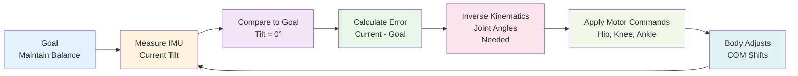

## Introduction

Why don't robots fall over when they walk? The answer lies in sophisticated control systems that continuously adjust joint angles to keep the center of mass over the support polygon. This chapter covers the physics of balance, a mathematical tool called inverse kinematics that lets robots figure out what joint angles achieve a desired foot placement, and the feedback control loops that make it all work in real-time. Boston Dynamics' Atlas can run, jump, and recover from pushes because it masters these concepts.

## Main Content

### Center of Mass and Support Polygon

Every object has a **center of mass (COM)**—the average position of all its mass. For a robot:

- **Head, torso, arms, legs** all contribute to COM location
- Moving limbs shifts COM position
- A robot falls if COM moves outside the support polygon (area enclosed by supporting feet)

For bipedal robots (2 feet), support polygon is small—falling is easy. For quadrupedal robots (4 feet), support polygon is larger—more stable. This is why dogs don't fall as often as humans.

### Stability Margin

**Stability margin** is the distance from COM projection to the edge of the support polygon. Larger margin = more stable = more room for disturbance before falling.

Example: A human standing with feet together has a narrow margin (~10 cm). If pushed even slightly, we might fall. Wide stance increases margin (~40 cm), providing more stability.

Robots use this principle—during dynamic walking, a robot widens its base of support when facing instability.

### Inverse Kinematics (IK)

**Kinematics** describes the relationship between joint angles and end-effector position (where the foot or hand is in space).

**Forward kinematics**: Given joint angles, calculate where the foot is.
**Inverse kinematics**: Given where you want the foot to be, calculate what joint angles achieve that.

IK is harder than forward kinematics—it's like asking "what arm positions let me touch the ceiling?" rather than "where is my hand when my arm is bent at 90 degrees?"

Many solutions can exist (or none at all). This is why humanoid robots are dexterous—they have enough degrees of freedom to reach most positions multiple ways.

### Feedback Control for Balance

A balance control loop for a humanoid robot:

1. **Measure** IMU data → current tilt angle
2. **Compare** to goal (0° tilt, body vertical)
3. **Calculate error** → how far from vertical?
4. **Compute adjustment** → using proportional control (Chapter 5), or more sophisticated algorithms
5. **Adjust hip, knee, ankle motors** to shift COM
6. **Repeat** 1000+ times per second

The control loop runs so fast that disturbances are caught before they become falls.

### Dynamic Stability vs. Static Stability

**Statically stable**: Can stand motionless without falling (COM over support).
**Dynamically stable**: Might be falling momentarily but control loop ensures next step catches body.

Boston Dynamics' Atlas prioritizes dynamic stability—it can accelerate, decelerate, and recover from pushes because the control loop constantly adjusts to maintain or restore stability.

## Diagram

**Figure 11**: Balance control feedback loop — IMU continuously measures tilt, and joint adjustments keep the robot vertical.

## Real-World Examples

**Boston Dynamics Atlas (Bipedal)**: Atlas uses a centralized state estimator that fuses IMU, encoder, and force sensor data. The control system then uses inverse kinematics to compute joint angles that achieve desired COM position and foot placement. When pushed, the system recomputes within milliseconds to maintain balance.

**Boston Dynamics Spot (Quadrupedal)**: Spot's balance control is distributed—each leg has local impedance control while the central system coordinates all four legs. This hybrid approach provides both responsiveness (local loops) and coordination (central planning).

**Tesla Bot (Bipedal with Arm Focus)**: Tesla's focus on dexterous manipulation means the balance controller must be robust to weight shifts caused by arm movements. Tesla Bot shifts its COM as arms move to maintain stability while manipulating objects.

## Did You Know?

- **Human Ankle Reflexes**: Our calf muscles have sensory feedback loops that respond to balance disturbances in ~50ms—faster than conscious thought. Robots attempt to achieve similar responsiveness with comparable feedback loop frequencies.

- **Passive Dynamics**: Some researchers build walkers with minimal actuators that exploit natural pendulum dynamics and gravity. These "passive walkers" can walk downslopes with zero power input—the ultimate in efficiency but limited to specific terrain.

- **COM Acceleration**: Advanced balance controllers don't just track COM position but also COM acceleration. By controlling acceleration, robots can achieve smooth, natural-looking movement instead of jerky positions.

## Try It!

1. **Balance Test**: Stand on one foot. Feel how your body constantly micro-adjusts to maintain balance. That's real-time feedback control!

2. **COM Shift**: Stand with arms at sides, then extend one arm to the side. Feel your body shift—your COM is moving to stay over your feet.

3. **Reaction Time**: Have a friend drop a ruler near your hand and catch it. Your reaction time is your "loop latency." Robots need similarly fast loops for balance.

## Summary

- **Center of mass** must stay over support polygon to avoid falling
- **Stability margin** is the safety buffer between COM and edge of support
- **Inverse kinematics** calculates joint angles to achieve desired foot positions
- **Feedback control loops** at 1000+ Hz maintain balance despite disturbances
- **Dynamic stability** allows robots to perform dynamic movements while staying upright

## Exercises

1. **Recall**: What is center of mass and why does it matter for balance?

2. **Comprehension**: Explain inverse kinematics. Why is it harder than forward kinematics?

3. **Analysis**: Why do robots need 1000 Hz balance control loops? What problems arise with slower loops?

4. **Synthesis**: Design a balance controller for a bipedal robot standing on a tilted platform. What sensors and actuators would you use?

## Recap

Balance is the foundation of bipedal locomotion. Humanoids must solve the balance problem in real-time, continuously adjusting joint angles to stay upright. In the next chapter, we'll explore how robots tackle even more challenging terrain—climbing, jumping, and navigating obstacles.

---

**Next: [Chapter 12: Climbing, Jumping & Terrain](./chapter-12-climbing-jumping-terrain.mdx)** — Learn how robots conquer obstacles and complex terrain.
