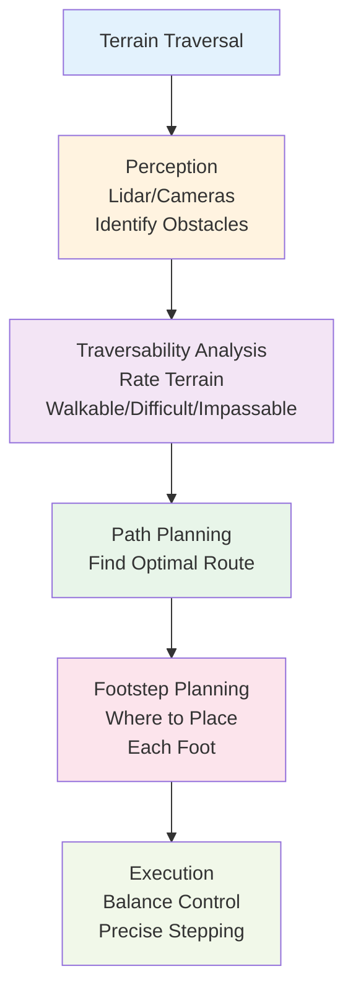

## Introduction

Flat ground is boring and unrealistic. Real robots must navigate stairs, rocks, slopes, and obstacles. This chapter covers the advanced locomotion strategies that allow robots like Boston Dynamics' Spot to climb vertical surfaces and Atlas to jump over obstacles. You'll learn how robots plan footsteps, estimate terrain traversability, and execute dynamic moves like jumping that require precise timing and force control.

## Main Content

### Stair Climbing

Climbing stairs requires:

1. **Perception**: Vision or lidar identifies stair edges, measures step height and depth
2. **Planning**: Algorithm determines foot placement sequence (which foot on which step)
3. **Balance**: Unusual center of mass position as robot leans forward
4. **Foot Placement**: Precise stepping—too high and robot can't lift leg, too low and foot misses step
5. **Power**: Sufficient motor torque to lift the robot's weight onto the next step

Boston Dynamics' Spot climbs stairs by:
- Using lidar to detect stair edges in real-time
- Planning a stepping sequence 3-5 steps ahead
- Continuously adjusting balance as center of mass shifts forward and up
- Using high torque leg motors to power up each step
- Monitoring foot contact sensors to confirm successful placement

### Obstacle Avoidance and Terrain Traversability

Robots don't just follow flat paths—they estimate whether terrain is walkable. A traversability map might rate areas:
- **Walkable** (low cost, green): Flat, clear ground
- **Difficult** (medium cost, yellow): Slopes, loose terrain
- **Impassable** (high cost, red): Steep cliffs, water

The robot then plans a path through the terrain, choosing the optimal balance between directness and ease of traverse.

### Jumping

Jumping requires:

1. **Planning**: Determine jump direction, distance, and landing location
2. **Preparation**: Crouch down, storing energy
3. **Explosion**: Simultaneously extend all joints to launch
4. **Airborne Phase**: No contact with ground, pure ballistics (gravity does the work)
5. **Landing**: Absorb impact with bent legs, control rate of deceleration

Boston Dynamics' Atlas can jump 1+ meters vertically—a feat requiring:
- Powerful leg actuators to achieve rapid leg extension
- Precise timing of all joints
- Impact absorption during landing (legs bend to dissipate energy gradually)
- IMU monitoring during airborne phase to adjust body orientation

The challenge: during the airborne phase, the robot can't sense ground and can't correct using normal balance feedback. It must rely on momentum and pre-planned landing.

### Soft Terrain and Deformable Surfaces

Robots on sand, mud, or snow face additional complexity. Soft terrain:
- Deforms under robot weight (harder to predict where feet will be)
- Provides less friction (easier to slip)
- Changes dynamically (footprints fill in as robot moves)

Agility Robotics' Cassie robot was tested on sand and demonstrated that with appropriate control adjustments (stiffer leg controllers, wider stance), even legged robots designed for hard terrain can traverse soft ground.

## Diagram

**Figure 12**: Terrain traversal pipeline — Multiple steps from raw perception to executed movement.

## Real-World Examples

**Boston Dynamics Spot - Stair Climbing**: Spot's viral stair climbing videos showcase seamless ascent and descent on steep stairs. The capability requires real-time perception, robust balance control, and high-torque leg motors.

**Boston Dynamics Atlas - Jumping Obstacles**: Atlas in recent videos demonstrates jumping over obstacles, running across uneven terrain, and recovering from being thrown off balance. These capabilities showcase years of control algorithm development.

**Agility Robotics Cassie - Soft Terrain**: Cassie (a bipedal research platform) has been tested on sand, ice, and outdoor terrain. Results show that with proper control tuning, even bipedal robots designed for hard surfaces can be adapted to soft ground.

## Did You Know?

- **Hopping vs. Walking**: Some research robots use hopping (bouncing on a single spring-like leg) for efficiency. Boston Dynamics' BigDog used a hopping gait for rough terrain before transitioning to quadrupedal walking in Spot.

- **Stair Descent Difficulty**: Ironically, descending stairs is harder for many robots than ascending. Walking down requires looking downward, which disrupts balance control, and requires careful foot placement to avoid pitching forward.

- **Energy Efficiency Trade-off**: Dynamic jumping is energetically expensive—the robot must generate force to propel itself upward against gravity. For long-distance travel, steady walking is more efficient. Jumping is used for obstacle avoidance, not distance.

## Try It!

1. **Stair Analysis**: Walk up stairs normally, then very slowly. Notice the balance adjustments needed. This is the challenge robots face.

2. **Soft Terrain Simulation**: Walk on sand if possible. Notice how your feet sink, how foot placement becomes less precise, how balance changes. That's what robots experience on soft ground.

3. **Jumping Physics**: Jump as high as you can. Feel the crouch, explosion, airborne phase, landing deceleration. That's the sequence robots must control.

## Summary

- **Stair climbing** requires perception, planning, balance, and powerful motors
- **Terrain traversability** assessment allows robots to navigate complex environments
- **Jumping** requires powerful leg motors, precise timing, and impact absorption
- **Soft terrain** requires adapted control strategies
- **Real-world obstacle navigation** combines perception, planning, and dynamic control

## Exercises

1. **Recall**: What are the main steps in climbing stairs for a robot?

2. **Comprehension**: Why is jumping harder than walking for a robot's control system?

3. **Analysis**: A robot needs to cross rough terrain with obstacles. How would you design its terrain assessment system?

4. **Synthesis**: Design a robot that climbs vertical rock walls. What sensors, actuators, and algorithms would you need?

## Recap

Robots operating in real environments must handle diverse terrain. The combination of perception, planning, and active balance control enables machines like Spot to traverse environments that would challenge simple wheeled robots. In the next chapter, we turn to energy—how robots optimize their movement for efficiency.

---

**Next: [Chapter 13: Energy Efficiency & Motion Optimization](./chapter-13-energy-efficiency-motion-optimization.mdx)** — Learn how robots move efficiently.
