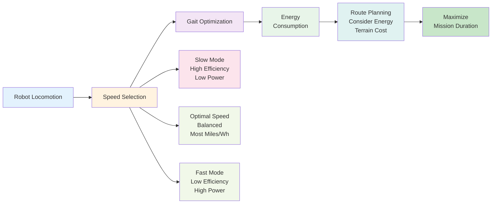

## Introduction

Battery life is precious for real robots operating in the field. A robot that burns through power in 1 hour is useless if it needs to work all day. This chapter covers how robots minimize energy consumption through clever gait optimization, intelligent speed selection, and motion planning that considers battery constraints. You'll learn why humans walk at certain speeds (it's the most efficient) and how robots discover their optimal gaits through algorithms or evolutionary approaches.

## Main Content

### Energy Consumption Sources

Legged robot energy use comes from:

1. **Motor Losses**: Electrical power to motors that produce heat (motors aren't 100% efficient)
2. **Mechanical Friction**: Joints, bearings, gearboxes all lose energy to friction
3. **Lifting Body Weight**: Moving legs up against gravity requires work (same reason climbing stairs is tiring)
4. **Accelerating Legs**: Speeding up leg motion and decelerating before footfall
5. **Balance Control**: Continuous small motor adjustments consume energy even when standing still

For comparison: wheeled robots only fight friction and motor losses (no leg lifting cost), making them more energy efficient for flat terrain. Humanoids pay the price of bipedal versatility with higher energy consumption.

### Optimal Walking Speed

Humans naturally walk at about 1.4 m/s—not because it's fastest, but because it's the most efficient speed for human biomechanics. Slower speeds require more awkward postures; faster speeds require greater muscle exertion.

Robots similarly have optimal speeds where energy-per-meter-traveled is minimized. This speed depends on:
- Leg length (longer legs = faster optimal speed)
- Motor efficiency curves (motors have efficiency peaks at certain RPMs)
- Gait type (trotting vs. walking vs. running have different efficiency profiles)

### Gait Optimization

Researchers use various approaches to find efficient gaits:

**Simulation-based Optimization**: Run thousands of simulated gaits in software, measure energy consumption, keep the efficient ones. This is fast but less realistic than testing on real robots.

**Genetic Algorithms**: Treat gait parameters as DNA, simulate, and "breed" efficient gaits. Inspired by evolution—sometimes produces surprising, natural-looking solutions.

**Experimental Tuning**: Have engineers manually adjust gait parameters on a real robot, measure battery consumption, iterate. Slower but directly optimizes for real hardware.

Boston Dynamics likely uses a combination: simulation for exploration, then experimental refinement on prototypes.

### Speed-Energy Tradeoffs

A robot has choices:
- **Slow (0.5 m/s)**: Low energy per second, but takes longer to reach destinations
- **Fast (3 m/s)**: Higher energy per second, but reaches destinations quicker, so less total energy on short trips
- **Optimal (~1.5 m/s)**: Lowest energy per meter traveled—the "sweet spot"

Real robots often operate at optimal speed for long missions, or faster speeds for urgent tasks (sacrificing efficiency for speed).

### Motion Planning with Energy Constraints

Advanced planners consider energy:
- Terrain traversability costs energy (rocky terrain = higher cost than flat)
- Path planning chooses routes that balance distance and energy
- Time constraints might override energy optimization (faster path if you're in a hurry)

Spot might choose:
- Efficient route through easy terrain (longer but lower energy)
- Versus faster route through hard terrain (shorter but higher energy)

### Passive Dynamics and Elastic Actuators

Humans leverage passive dynamics—our tendons store elastic energy like springs, releasing it during walking to reduce muscle work. Robots attempting this use:

**Series Elastic Actuators**: Motor connected to load through a spring. Energy storage during impact absorption, release during propulsion.

**Compliant Joints**: Intentionally flexible joints that absorb and store energy, rather than rigidly resisting.

Spot uses relatively stiff joints optimized for rapid control response. Research robots exploring elastic approaches have found interesting efficiency gains, though control becomes more complex.

## Diagram

**Figure 13**: Energy optimization — Speed, gait, and route planning all affect battery consumption.

## Real-World Examples

**Boston Dynamics Spot**: Spot achieves impressive runtime (several hours of operation on a charge) through careful gait optimization and efficient leg design. Modern videos show Spot using variable-speed locomotion depending on terrain and task.

**Tesla Bot Factory**: Factory deployment prioritizes reliability and manipulation precision over long runtime (factories have charging available). Energy efficiency less critical than precision and speed for task execution.

**Autonomous Inspection Robots**: Robots deployed for long-duration surveillance missions (weeks of continuous operation) prioritize energy efficiency above all else. Some research platforms achieve kilometers of travel on small batteries through optimized gaits.

## Did You Know?

- **Cost of Transport**: Biologists measure energy efficiency as "cost of transport"—energy per unit weight per unit distance. Humans: ~0.5 J/(kg·m). Spot: estimated ~0.8-1.0 J/(kg·m). Wheeled robots: ~0.1-0.2 J/(kg·m). Evolution has optimized humans remarkably well.

- **Battery Technology**: Solid-state batteries (next generation) promise 2-3x energy density. This could dramatically extend robot autonomy without changing mechanics.

- **Passive Walkers**: Some research robots achieve walking downhill with nearly zero battery power, exploiting gravitational potential energy. The ultimate in efficiency, albeit on limited terrain.

## Try It!

1. **Walking Efficiency**: Walk at different speeds for short distances. Which speed feels most natural and least tiring? That's likely your optimal speed.

2. **Energy Awareness**: Climb stairs slowly, then quickly, then at normal pace. Feel the difference in exertion. That's speed-energy tradeoff.

3. **Spring Dynamics**: Jump and feel the spring in your legs—your tendons absorbing and releasing energy. Rigid legs would require more muscle work.

## Summary

- **Energy consumption** in robots comes from motor losses, friction, lifting legs, acceleration, and balance control
- **Optimal walking speeds** minimize energy-per-distance
- **Gait optimization** uses simulation, genetic algorithms, or experimental tuning
- **Speed-energy tradeoffs** allow robots to prioritize efficiency or speed
- **Passive dynamics** and elastic actuators can reduce energy consumption

## Exercises

1. **Recall**: What are three sources of energy consumption in legged robot locomotion?

2. **Comprehension**: Why do humans naturally walk at ~1.4 m/s instead of faster or slower?

3. **Analysis**: A robot has 1 kWh battery and two options: (A) slow efficient route using 100 Wh, or (B) fast less-efficient route using 150 Wh. What factors would determine which is better?

4. **Synthesis**: Design an energy optimization system for a robot that must explore an unknown environment. How would you balance distance covered vs. energy consumed?

## Recap

Module 3 has taken you from basic walking through complex terrain, culminating in energy-efficient movement. These locomotion skills are essential for robots operating in the real world.

You now understand:
- How robots walk and maintain balance
- How they handle complex terrain
- How they optimize energy for long missions

Module 4 shifts focus from movement to intelligence—planning and control, the "brain" behind robot actions.

---

**Module 3 Complete!** You've mastered locomotion—the physical foundation of robotics.

**Next: [Chapter 14: Path Planning & Navigation](../module-04-planning-control/chapter-14-path-planning-navigation.mdx)** — Learn how robots plan where to go and how to get there.
