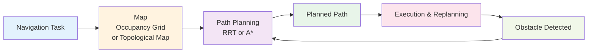

## Introduction

You want a robot to go from your front door to your kitchen. The robot must avoid furniture, stairs, and walls. It must find a path that's safe and efficient. This is the path planning problem—one of robotics' fundamental challenges. In this chapter, you'll learn about the algorithms robots use to plan routes: how they represent environments as maps, search for collision-free paths, and replan when obstacles block their route. Understanding path planning is key to understanding how autonomous robots navigate complex spaces.

## Main Content

### The Path Planning Problem

Given:
- Start position
- Goal position
- Map of obstacles and traversable space
- Robot's size and shape

Find:
- A path from start to goal that doesn't collide with obstacles
- Ideally, the path should be efficient (short, low-energy, safe)

This seems simple but becomes complex with:
- Continuous spaces (infinite possible positions)
- High dimensions (not just 2D position, but also rotation, arm configuration)
- Dynamic obstacles (other robots or people moving)
- Uncertainty (map might be incomplete or wrong)

### Occupancy Grids

Many robots represent their environment as an **occupancy grid**—a 2D or 3D grid where each cell represents whether that space is free, occupied, or unknown.

Example:
```
####################
#S...................#  S = Start
#.###.....##........#  . = Free
#....#...........G..#  # = Occupied
####################  G = Goal
```

The robot can be sure about grid cells it has directly observed. Unobserved cells are marked unknown. As the robot explores, it updates the map with new observations.

### Rapidly-Exploring Random Trees (RRT)

**RRT** is a popular algorithm for planning in high-dimensional spaces:

1. Start with a tree containing just the start position
2. Randomly sample a position in the space
3. Find the closest point on the current tree
4. Grow the tree toward the random sample (avoiding obstacles)
5. If the sample or new tree point is near the goal, try connecting directly to goal
6. Repeat until goal is reached or time limit expires

RRT works well because:
- Simple to implement
- Fast (often finds rough solutions quickly)
- Handles high-dimensional planning (multiple joints in a robot arm)
- Probabilistically complete (given infinite time, will find a path if one exists)

The randomness helps RRT explore the space efficiently, unlike older grid-based methods that require searching every cell.

### A* Algorithm

**A*** (pronounced "A-star") is a classic path planning algorithm that searches through possible paths, using heuristics to guide the search toward the goal.

Core idea: estimate "cost-to-goal" for each position, prioritizing positions that are likely close to the goal.

A* is optimal (finds shortest path) and complete (finds a path if one exists) when used with appropriate heuristics. It works well on discrete grids but struggles with continuous high-dimensional spaces.

### Navigation in Dynamic Environments

Real environments change—people move, doors open, obstacles appear. Robots must replan dynamically:

1. Execute planned path
2. Continuously sense the environment
3. If obstacle detected in path ahead, trigger replanning
4. Compute new path around obstacle
5. Continue

Boston Dynamics' Spot uses a hybrid approach:
- High-level planning (A* on downsampled occupancy grid) for large-scale navigation
- Local obstacle avoidance (real-time reactive control) for small obstacles
- Continuous replanning when maps update from lidar data

### SLAM (Simultaneous Localization and Mapping)

If the environment is unknown, the robot must:
- Build a map while exploring (mapping)
- Track its own position within that map (localization)

**SLAM** algorithms fuse sensor data to accomplish both simultaneously. A robot using SLAM:
1. Explores unknown environment
2. Detects visual landmarks or lidar features
3. Maintains a map of detected landmarks
4. Estimates its own position relative to landmarks
5. Uses position to navigate and update map

Advanced SLAM systems can close loops—recognizing previously visited locations, correcting accumulated error, and maintaining map consistency.

## Diagram



**Figure 14**: Navigation pipeline — Plan, execute, replan based on new observations.

## Real-World Examples

**Boston Dynamics Spot Navigation**: Spot combines RRT-style planning for large-scale path selection with A*-style optimization for detailed routes. The system continuously updates a local occupancy grid from lidar data, replanning when obstacles appear.

**Tesla Bot Warehouse**: Tesla Bot navigates known factory floor plans using pre-computed maps. Path planning focuses on efficiency (shortest path, minimizing travel time) while avoiding stationary obstacles.

**Autonomous Exploration Robots**: Research robots deployed to explore unknown environments (caves, other planets) rely heavily on SLAM—simultaneously building maps and localizing, since no pre-existing map is available.

## Did You Know?

- **Computational Complexity**: Path planning is NP-hard in the general case—no known algorithm guarantees fast solutions for all scenarios. RRT's probabilistic approach sidesteps this by trading optimality for speed.

- **Waypoint Following**: Before modern algorithms, robots used waypoints (manually specified positions). A robot would navigate from waypoint to waypoint. Still used today for predictable environments (factories).

- **Natural Language Planning**: Advanced systems let humans specify goals naturally ("Go get the coffee from the kitchen"). The robot translates this to coordinates and plans paths autonomously.

## Try It!

1. **Maze Navigation**: Try solving a maze on paper or mentally. This is essentially path planning!

2. **Route Planning**: Looking at a map, plan a route from point A to point B. What obstacles do you consider? Steep hills? Long detours? Robots consider similar factors.

3. **Replanning**: Plan a route, then imagine a roadblock appears midway. Plan around it. Robots do this continuously with sensor data.

## Summary

- **Path planning** finds collision-free routes through complex environments
- **Occupancy grids** represent environments as free/occupied/unknown cells
- **RRT** (Randomly-Exploring Random Trees) efficiently handles high-dimensional planning
- **A*** uses heuristics to guide search toward goals on grids
- **Dynamic replanning** handles obstacles and environment changes
- **SLAM** simultaneously builds maps and localizes in unknown environments

## Exercises

1. **Recall**: What is path planning and what are the main inputs and outputs?

2. **Comprehension**: Explain how RRT works at a high level. Why is randomness useful?

3. **Analysis**: A robot must choose between RRT and A* for warehouse navigation. Which would you recommend and why?

4. **Synthesis**: Design a navigation system for a robot that must explore an unknown environment and report back with a map.

## Recap

Path planning is the "where" question—where should the robot go? In the next chapter, you'll learn about AI agent architectures—the high-level "why" and "how" questions that drive robot decision-making.

---

**Next: [Chapter 15: AI Agent Architectures](./chapter-15-ai-agent-architectures.mdx)** — Learn how robots make intelligent decisions.
