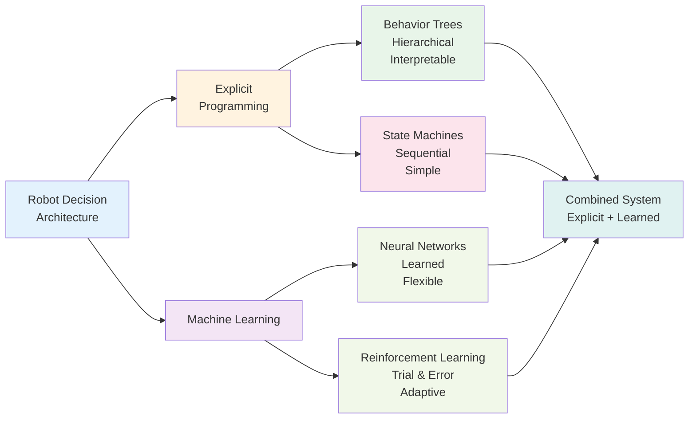

## Introduction

A robot must constantly make decisions: Where should I go? What object should I manipulate? How hard should I grip? Should I avoid this obstacle by going left or right? These decisions range from simple (yes/no: is this surface traversable?) to complex (multi-step reasoning: navigate here, manipulate this, return there). In this chapter, you'll learn about different architectures for robot decision-making, from explicit behavior trees to learned neural networks. You'll see how Tesla Bot and Boston Dynamics robots combine both approaches for robust, flexible behavior.

## Main Content

### Behavior Trees

A **behavior tree** is a graphical/hierarchical representation of robot behavior, inspired by game AI and military tactics planning.

Example structure:
```
Root: Navigate and Manipulate
├─ Selector: Try Each Option
│  ├─ Sequence: Go to Object A
│  │  ├─ Check if Object A visible
│  │  ├─ Plan path to Object A
│  │  └─ Navigate to Object A
│  └─ Sequence: Go to Object B
│     ├─ Check if Object B visible
│     ├─ Plan path to Object B
│     └─ Navigate to Object B
```

Key concepts:
- **Sequence**: All children must succeed (AND logic)
- **Selector**: First child to succeed wins (OR logic)
- **Action nodes**: Perform actual work (move, grasp, etc.)
- **Condition nodes**: Check state (is object visible?)

Behavior trees are:
- Explicit and interpretable (you can read the logic)
- Modular and reusable
- Easier to debug than other approaches
- Limited to pre-programmed behaviors

Tesla Bot likely uses behavior trees for factory tasks—navigate to assembly station, pick part, place in fixture, repeat.

### State Machines

A **state machine** represents robot behavior as discrete states and transitions between them.

Example for grasping an object:
```
States: Idle → Reaching → Grasping → Retracting → Idle

Idle:
  - See object → go to Reaching

Reaching:
  - Arm near object → go to Grasping
  - Obstacle detected → back to Idle

Grasping:
  - Object grasped (force sensor) → go to Retracting
  - Timeout without grip → back to Idle

Retracting:
  - Arm retracted → go to Idle
```

State machines are:
- Simple to understand
- Good for sequential tasks
- Less flexible than behavior trees
- Can become complex with many states and transitions

### Hierarchical Control

Complex robot tasks break down hierarchically:

**Level 1 (Highest)**: Goal-level reasoning
- "Fetch the coffee" → where is coffee? Plan path

**Level 2**: Task-level control
- "Navigate to kitchen" → path planning, obstacle avoidance

**Level 3**: Action-level control
- "Move left leg forward" → servo motor commands

**Level 4 (Lowest)**: Real-time control loops
- Balance feedback, motor current limiting

This hierarchy allows:
- High-level decision-making (AI layer)
- Real-time reactivity (control loops)
- Separation of concerns (planners don't worry about motor timing)

### Neural Networks for Control

**End-to-end learning** trains a neural network directly from sensor inputs to motor outputs, skipping explicit programming:

Traditional approach: Vision → Object Detection → Planning → Control → Motors
End-to-end: Vision → Neural Network → Motors

Advantages:
- Learns subtle, non-obvious control strategies
- Can adapt to new situations after training
- Often outperforms hand-crafted controllers

Disadvantages:
- Requires large amounts of training data
- "Black box"—hard to understand why decisions are made
- May fail unpredictably on edge cases

Tesla likely uses neural networks trained on factory video data to recognize assembly tasks, fixtures, and parts. Boston Dynamics has demonstrated learned locomotion behaviors.

### Combining Architectures

State-of-the-art robots combine multiple approaches:

**Boston Dynamics Atlas**:
- **Hierarchical planner**: High-level task decomposition
- **Behavior trees**: Sequences of actions (grasp, carry, place)
- **Real-time control**: Feedback loops for balance and motor control
- **Neural networks** (emerging): Learning from demonstration for new tasks

**Tesla Bot**:
- **Factory-specific behavior trees**: Designed for known assembly tasks
- **Computer vision (neural networks)**: Object and fixture recognition
- **Hierarchical control**: Task → Action → Motor command levels
- **Real-time feedback loops**: Force control, balance

### Learning from Demonstration

Robots can learn behaviors by observing humans:

1. Human performs task (e.g., grasping an object)
2. Robot records human motion (e.g., via motion capture suit)
3. Robot imitates, then learns variations
4. Over time, robot improves through practice

This approach combines explicit programming (the base task) with learned refinement (how to handle variations).

## Diagram



**Figure 15**: Decision-making architectures — Explicit and learned approaches complement each other.

## Real-World Examples

**Boston Dynamics Atlas**: Uses all approaches—explicit state machines for known tasks, neural networks for perception and object recognition, and hierarchical control for complex sequences.

**Tesla Bot**: Designed for repetitive factory tasks where behavior trees and state machines work well. Vision systems (neural networks) recognize parts and fixtures. Real-time control loops handle force feedback during assembly.

**Research Robots (MIT, UC Berkeley)**: Increasingly use deep reinforcement learning where robots learn control policies by trial and error in simulation, then transfer to real robots.

## Did You Know?

- **Sim-to-Real Transfer**: Training in simulation is cheap and fast. Real robot training is expensive (hardware wear, time). Modern approaches train in simulation, then refine on real robots with minimal data.

- **Interpretability vs. Performance**: Explicit behavior trees are interpretable (you understand why robot did X). Neural networks often perform better but are "black boxes" (you don't know why). This tradeoff affects safety-critical robotics.

- **Embodied Intelligence**: Some researchers argue that intelligence cannot be separated from embodiment (having a body, experiencing the world). A robot learning to walk must experience gravity, friction, and falling. Simulation can only approximate this.

## Try It!

1. **Design a Behavior Tree**: For a robot making breakfast (toast, eggs, coffee), design a behavior tree. What sequences? What conditions?

2. **State Machine**: Design a state machine for a robot arm picking objects. What are the states? Transitions?

3. **Decision Difficulty**: List 5 decisions a household robot might make. Which are easy to program explicitly? Which might benefit from learning?

## Summary

- **Behavior trees** provide hierarchical, modular decision-making
- **State machines** handle sequential task decomposition
- **Hierarchical control** separates high-level reasoning from real-time control
- **Neural networks** enable learned behaviors and adaptability
- **Combined systems** use explicit programming for reliability and learning for flexibility

## Exercises

1. **Recall**: What are behavior trees and state machines? When would you use each?

2. **Comprehension**: Explain end-to-end learning for robots. What are advantages and disadvantages?

3. **Analysis**: For factory assembly, would you use explicit programming (behavior trees) or neural networks? Why?

4. **Synthesis**: Design a decision-making system for a robot exploring unknown terrain. How would you combine explicit planning with learned adaptation?

## Recap

Decision-making is the "why" and "how" of robot action. Combined with path planning (where to go), perception (what to sense), and control (how to move), decision-making systems complete the intelligent robot pipeline.

In the next chapter, we address the final frontier: real-time decision-making under latency and uncertainty constraints.

---

**Next: [Chapter 16: Real-Time Decision Making](./chapter-16-real-time-decision-making.mdx)** — Learn how robots decide instantly in dynamic environments.
