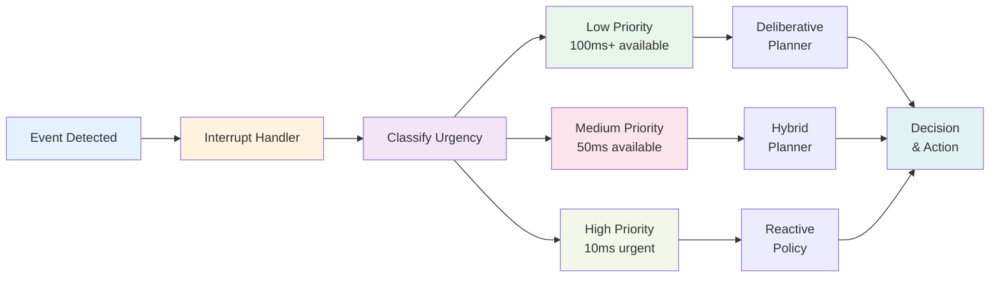

## Introduction

Imagine you're riding a bicycle at speed when a car suddenly cuts in front of you. You don't consciously think "calculate collision trajectory, compute optimal braking force, execute brake command." You react instantly. Robots face similar challenges in dynamic environments—they must make life-or-death decisions (avoiding collisions) faster than conscious reasoning allows. This chapter covers real-time decision-making: how robots handle latency, prioritize urgent decisions, balance planning with reactivity, and recover from mistakes in milliseconds.

## Main Content

### Reactive vs. Deliberative Control

**Deliberative Control** (Slow, Thoughtful):
- Gather complete information
- Consider many options
- Plan optimal strategy
- Execute plan
- Time: 100ms to seconds

Suitable for: Strategic decisions, long-term planning

Example: "How should I navigate across the building?"

**Reactive Control** (Fast, Automatic):
- Detect immediate threat/opportunity
- Choose pre-programmed response
- Execute instantly
- Time: 1-10ms

Suitable for: Safety, collision avoidance

Example: "Human approaching from my left—don't bump into them"

**Hybrid Approach** (State-of-the-Art):
- Deliberative planning for long-term strategy
- Reactive control for immediate safety
- Communication between layers

Boston Dynamics robots use this hybrid approach:
- Deliberative: Long-term mission planning (navigate building, find target)
- Reactive: Real-time balance, collision avoidance, emergency stop

### Interrupt-Driven Decision Making

Robot systems use **interrupts**—high-priority events that pause normal operation:

**Low Priority (Polled, every 100ms)**:
- Goal reaching? Navigate to next destination
- Task completion check

**Medium Priority (Checked frequently)**:
- Path blocked? Replan route
- Energy low? Return to charger

**High Priority (Interrupt, immediate)**:
- Collision imminent? Stop/dodge
- Fall detected? Activate emergency stabilization
- Motor failure? Disable affected joint

This hierarchy allows robots to maintain high-level strategy while reacting instantly to threats.

### Decision Latency Budgets

A robot might allocate decision time like:

```
Perception latency:     20ms (sensor + processing)
Planning latency:       30ms (compute next action)
Motor latency:          10ms (actuators respond)
Total latency:          60ms

Reaction time required: < 100ms (before human would notice delay)
Safety margin:          40ms (buffer for unexpected delays)
```

Given 60ms latency, a robot walking at 1 m/s covers 6 cm before reacting to an obstacle. This is usually acceptable but requires defensive driving (conservative speeds in crowded areas).

### Predictive Decision-Making

To compensate for latency, robots predict:

**Where will obstacles be in 60ms?**
- See person approaching
- Estimate their velocity
- Predict future position
- Plan avoidance now, not when they're in the way

This requires:
- Tracking moving objects
- Estimating their velocities
- Extrapolating trajectories
- Margin of safety (what if estimate is wrong?)

### Bounded Rationality

Robots can't search all possible actions—computation is limited. Instead:

**Satisficing** (not optimizing):
- Generate good-enough solutions quickly
- Don't wait for perfect solutions
- Update as more information arrives

Example: Path planning with 50ms budget:
- Find quick rough path immediately (RRT)
- Refine path continuously as more time available
- Use best-available path at execution time

### Priority-Based Decision Making

Conflicting goals require prioritization:

**Goal hierarchy**:
1. **Safety** (absolute): Don't fall, don't collide
2. **Task completion** (high): Do what you're commanded
3. **Efficiency** (medium): Accomplish task quickly
4. **Comfort** (low): Move smoothly, avoid jitter

When resources are scarce (CPU, battery), sacrifice lower-priority goals.

### Learning Reactive Policies

Rather than hand-coding reactive behaviors, robots can learn them:

**Reinforcement Learning**:
- Train robot in simulation or real world
- Reward safe, effective reactions
- Punish crashes and failures
- Neural network learns reactive policy
- Deploy learned policy on real robot

Example: Learned collision avoidance (train robot to navigate crowds without bumping into people) beats hand-coded rules in many scenarios.

## Diagram



**Figure 16**: Real-time decision hierarchy — Different urgencies routed to different decision systems.

## Real-World Examples

**Boston Dynamics Atlas**: Exhibits remarkable real-time decision-making. Video shows Atlas recovering from being thrown off balance—the robot detects tilt, reacts within 10ms, and restabilizes. This requires deeply embedded reactive control loops.

**Boston Dynamics Spot**: Navigates crowds while maintaining task execution. Reactive collision avoidance operates at 1000 Hz (1ms decisions), while deliberative path planning operates at 10 Hz (100ms decisions).

**Tesla Bot in Factories**: Must coexist with human workers. Critical real-time decision: detect human proximity and decelerate/stop to avoid collision. Human safety overrides all other priorities.

## Did You Know?

- **Dual-Process Theory**: Cognitive psychology describes two thinking modes: fast, automatic (System 1) and slow, deliberate (System 2). Robots explicitly implement both.

- **Murphy's Law in Robotics**: "Anything that can go wrong will go wrong." Real-time systems must anticipate failures. What if planner crashes? Reactive layer should still prevent falls.

- **Competitive Decision-Making**: Multi-robot systems face game-theoretic challenges. If multiple robots are deciding what to do, their decisions interdepend. Research explores multi-agent planning where robots reason about each other's decisions.

## Try It!

1. **Reaction Time Experiment**: Drop a ruler between a friend's fingers—they catch it. Their reaction time is your result in centimeters. Typical human: ~17cm (170ms latency). Robots can react 10x faster.

2. **Priority Conflicts**: List situations where a robot might face conflicting goals. How should it prioritize?

3. **Predictive Driving**: Imagine navigating a crowded street. You predict where people will be, not where they are now. That's what robots do.

## Summary

- **Reactive control** enables instant responses (< 10ms)
- **Deliberative planning** allows strategic decision-making (100ms+)
- **Hybrid systems** combine both for robustness
- **Interrupt-driven** architecture prioritizes urgent events
- **Latency budgets** allocate time for sensing, planning, action
- **Predictive** decision-making compensates for delays
- **Bounded rationality** finds good-enough solutions quickly

## Exercises

1. **Recall**: Explain the difference between reactive and deliberative control. When is each appropriate?

2. **Comprehension**: What is an "interrupt" in robot decision-making? Give an example.

3. **Analysis**: A robot detects a person 2 meters away approaching. With 60ms latency, what distance would they cover? How does a robot handle this?

4. **Synthesis**: Design a real-time decision system for a humanoid robot working alongside humans in a factory. What decisions are reactive vs. deliberative?

## Recap

Module 4 has taken you from navigation (where to go) through decision-making architectures (why to go) to real-time constraints (how fast you can decide). These are the intellectual foundations of robot autonomy.

You now understand:
- How robots plan paths and navigate
- How they make intelligent decisions
- How they handle the latency constraints of real-time systems

Module 5 ties everything together with real-world case studies—seeing complete robot systems in action.

---

**Module 4 Complete!** You've mastered planning and control—the intelligence layer of robotics.

**Next: [Chapter 17: Tesla Bot Case Study](../module-05-case-studies/chapter-17-tesla-bot-case-study.mdx)** — See how all these concepts work together in a real robot.
