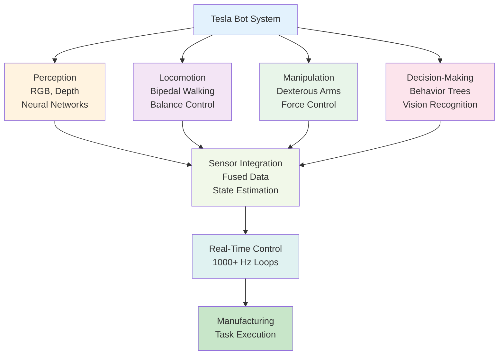

## Introduction

Throughout this textbook, you've learned about individual pieces of humanoid robotics: sensors, actuators, balance, navigation, and decision-making. Now let's see how Tesla Bot integrates all of these into a working system designed for real manufacturing. Tesla Bot represents a deliberate engineering philosophy: humanoid form factor for human-compatible workspaces, dexterous arms for fine manipulation, and AI trained on Tesla's own factory data. This case study ties together everything you've learned and shows how theory becomes practice.

## Main Content

### Design Philosophy

**Why Humanoid?**
Tesla factories are designed for human workers. Stairs, doorknobs, tools, and workstations all assume a humanoid body. Rather than redesign the factory for the robot, Tesla Bot fits the humanoid form factor to the existing environment.

**Why Dexterous?**
Tesla Bot prioritizes fine manipulation—the robot must pick small parts (circuit boards, fasteners), place them precisely, and handle delicate assembly operations. High DOF arms and articulated fingers are essential.

**Why Tesla?**
Tesla's vertical integration (owning factories, controlling supply chain) means:
- Access to massive amounts of factory video data for training vision systems
- Control over factory environment (can optimize for robot deployment)
- Ability to iterate rapidly (test robots in real factories, refine based on data)

### Architecture Breakdown

**Physical Structure**:
- Height: ~5'8" (170 cm) — human compatible
- Weight: ~125 lbs (57 kg) — lighter than a human
- 40 electromechanical actuators (motors)
- Articulated hands with individual finger control
- Bipedal locomotion system

**Perception Stack**:
- RGB cameras (multiple viewpoints for comprehensive vision)
- Depth cameras for object grasping and obstacle avoidance
- Force sensors in hands for grip control
- IMU for balance and orientation

**Decision-Making**:
- Computer vision (neural networks trained on factory data) for object/fixture recognition
- Behavior tree framework for manufacturing task sequences
- Hierarchical control: High-level task → Action sequence → Motor commands

**Control Stack**:
- Real-time balance and motor control loops (1000+ Hz)
- Inverse kinematics for arm motion planning
- Force feedback for precise manipulation

### Manufacturing Tasks

Tesla Bot is designed for repetitive, potentially dangerous factory tasks:

**Task Categories**:
1. **Welding assistance** — Hold parts while human welds
2. **Parts kitting** — Assemble sub-assemblies from components
3. **Parts placement** — Arrange parts on assembly line
4. **Tool operation** — Use hand tools (screwdrivers, torque wrenches)
5. **Quality inspection** — Visual verification of assembly

Each task requires:
- Accurate object detection (where is the part?)
- Precise arm motion (reach to correct location)
- Force control (grip strength appropriate to part fragility)
- Sequence coordination (do assembly steps in correct order)

### Safety Integration

Tesla Bot working alongside human workers requires rigorous safety:

**Physical Safety**:
- Force-limiting joints (can't punch through a wall or crush a human)
- Emergency stop systems (kill switch for immediate shutdown)
- Slow, predictable motion (humans can observe and react)

**Situational Awareness**:
- Cameras monitoring work area for human presence
- Distance sensors preventing collisions
- Automatic deceleration if humans approach

**Fallback Behavior**:
- If uncertain, stop
- If human proximity detected, freeze until human moves away
- Battery low → return to charging station

### Training and Adaptation

Tesla Bot learns through:

**Supervised Learning**:
- Tesla trains vision models on factory floor video
- Techs label images (show where parts are, which fixtures to use)
- Neural network learns to recognize objects and fixtures

**Reinforcement Learning** (Emerging):
- Robot performs task in simulation
- Gets rewarded for success, penalized for failures
- Learns control policies that work in real deployment

**Iterative Refinement**:
- Deploy robot in limited capacity
- Collect failure cases
- Retrain models
- Expand deployment

### Real-World Deployment Challenges

**Challenge 1: Variability**
Real manufacturing has exceptions:
- Parts might be slightly misaligned
- Fixtures might have subtle variations
- Lighting changes throughout the day

Tesla Bot must:
- Recognize when situation is outside training distribution
- Recover from small errors (grasp failed, re-grip differently)
- Flag genuinely novel situations for human intervention

**Challenge 2: Power and Thermal Management**
Factory shifts are 8-12 hours. Tesla Bot must:
- Operate multiple hours between charges
- Manage heat from motors and computing
- Schedule charging during breaks

Current design targets 4-8 hours runtime, requiring charging infrastructure in factory.

**Challenge 3: Reliability**
A robot breaking down in manufacturing context is costly. Tesla Bot must:
- Detect component failures (motor not responding as expected)
- Degrade gracefully (lose arm dexterity but continue basic tasks)
- Maintain detailed diagnostics for maintenance

**Challenge 4: Economic Viability**
The robot must be cost-effective:
- Current estimate: $20,000-$25,000 per unit (under development)
- Must provide value > cost + maintenance + training
- Payoff period: 2-3 years for full deployment

### Comparison: Tesla Bot vs. Boston Dynamics

| Aspect | Tesla Bot | Boston Dynamics |
|--------|-----------|-----------------|
| Design Purpose | Manufacturing | Research + Exploration |
| Form Factor | Bipedal, human proportions | Bipedal (Atlas) or Quadruped (Spot) |
| Locomotion Focus | Walking, manipulation | Running, climbing, jumping |
| Deployment | Factories (repetitive) | Diverse environments |
| Speed | Moderate | High (Atlas runs 7+ m/s) |
| Vision Focus | Factory-specific objects | General environment navigation |

### Future Roadmap

Tesla's likely progression:
1. **Phase 1** (Current): Demonstrate capability in controlled factory environment
2. **Phase 2**: Limited deployment (1-5 robots per factory doing simple tasks)
3. **Phase 3**: Broader deployment (dozens of robots, more complex tasks)
4. **Phase 4**: Refinement and cost reduction (targeting economies of scale)
5. **Phase 5** (Long-term): General-purpose household robots derived from Tesla Bot platform

## Diagram

**Figure 17**: Tesla Bot system architecture — All robotics subsystems integrated.

## Real-World Implications

**What Tesla Bot Success Means**:
- Viable commercial humanoid robots for manufacturing
- Proof that dexterous manipulation is achievable
- Evidence that factory automation can be flexible (human-compatible)

**What It Doesn't Mean**:
- General-purpose household robots are here
- Robots will replace all human workers soon
- Robot development is approaching completion

Manufacturing is uniquely suited for early humanoid deployment: repetitive, somewhat predictable, safety-controlled environment. General-purpose robots facing open-ended human environments are much harder.

## Did You Know?

- **Tesla Bot Timeline**: First announced in 2021, prototypes being developed 2023-2025, limited manufacturing deployment expected mid-2020s
- **Boston Dynamics Approach**: Boston Dynamics focuses on motion mastery first, task applications second. Tesla Bot is task-focused from the start
- **Competitor Robots**: Boston Dynamics, Unitree, and Chinese companies like Fourier are all developing humanoid robots with similar goals

## Try It!

1. **Factory Layout Design**: Imagine redesigning a factory for humanoid robots. What would you change? What would you keep human-compatible?

2. **Task Decomposition**: Take a manufacturing task (assemble a circuit board, for example). Break it down into steps. Which steps are easy for robots? Which hard?

3. **Cost Justification**: Research labor costs and robot costs. How would you justify $20K robot investment to a factory manager?

## Summary

- **Tesla Bot integrates all robotics concepts**: perception, locomotion, manipulation, decision-making
- **Manufacturing context** makes humanoid robots economically and technically viable
- **Dexterous arms** enable manipulation tasks
- **Real-time control** and **safety systems** required for human environments
- **Training and adaptation** enable generalization to factory variations

## Exercises

1. **Recall**: List the major subsystems of Tesla Bot and what each does.

2. **Comprehension**: Why did Tesla choose humanoid form factor instead of specialized robots?

3. **Analysis**: What are the biggest challenges Tesla Bot faces in real factory deployment?

4. **Synthesis**: Design a manufacturing task that would be difficult for Tesla Bot. Why? How would you modify the robot or task?

## Recap

Tesla Bot demonstrates that humanoid manufacturing robots are moving from research labs to real-world deployment. The combination of sensors, actuators, control systems, and AI learned from factory data creates a capable, economically interesting system.

In the final chapter, we'll address broader integration challenges that all robots face: thermal management, power systems, and the software-hardware integration nightmare that is modern robotics.

---

**Next: [Chapter 18: Integration Challenges & Future Horizons](./chapter-18-integration-challenges-future-horizons.mdx)** — Explore the practical challenges of complete robot systems.
