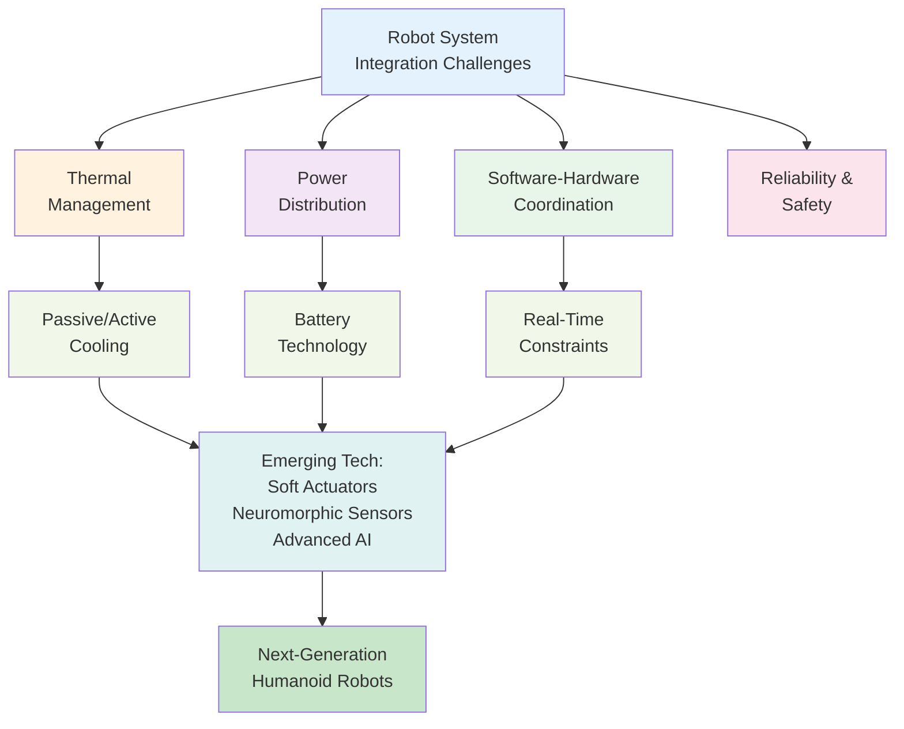

## Introduction

A humanoid robot isn't just a collection of parts—it's a complex system where everything affects everything else. A motor running too hot degrades performance. Power drawn by one system starves another of current. Software delays in one component cascade into latency in another. In this final chapter, you'll learn about the practical integration challenges that separate research prototypes from deployable robots. You'll also explore emerging technologies that could transform robotics: better batteries, soft actuators, neuromorphic sensors, and AI breakthroughs. Welcome to the frontier of humanoid robotics.

## Main Content

### Thermal Management

Robots generate heat from:
- **Motor inefficiency** (motors are ~80-90% efficient; 10-20% becomes heat)
- **Electronic components** (processing, power conversion)
- **Joint friction** (gearboxes, bearings)

Heat problems:
- **Component damage**: Motors and electronics have temperature limits (typically 80-100°C)
- **Performance degradation**: Electric motors lose efficiency at high temperature
- **Sensor errors**: IMUs and other sensors drift with temperature changes
- **Battery damage**: Lithium batteries degrade rapidly above 60°C

**Thermal Management Strategies**:

1. **Passive cooling**: Aluminum chassis dissipates heat to environment
2. **Active cooling**: Fans or liquid cooling loops (adds weight, power consumption, complexity)
3. **Thermal throttling**: Reduce motor power if temperature rises (sacrifices performance)
4. **Task scheduling**: Avoid pushing all motors hard simultaneously
5. **Material selection**: High thermal conductivity materials in motor mounting

Boston Dynamics' robots use primarily passive cooling but with careful mechanical design (large surface area for heat dissipation). Tesla Bot will likely need active cooling for continuous factory operation.

### Power System Integration

**Battery Technology**:
- Lithium-ion (current standard): ~200-250 Wh/kg
- Solid-state (emerging): ~400+ Wh/kg (2x energy density)
- Supercapacitors: Fast charging but lower energy density

**Power Distribution Challenges**:
1. **Peak vs. Average**: A robot walking uses X watts average, but jumping spikes to 5X watts. Battery and power distribution must handle spikes.
2. **Voltage regulation**: Different components need different voltages (high-voltage motor drivers, low-voltage processors). Power converters waste ~10-15% as heat.
3. **Cable routing**: Heavy power cables add mass, complicate mechanical design
4. **Safety**: Short circuit protection, over-current shutdown

**Power Budgeting Example**:
- Battery: 2 kWh (typical for 4-8 hour robot runtime)
- Motors average draw: 250 W (during walking)
- Computing/Electronics: 50 W
- Overhead/Inefficiency: 50 W
- Total average: 350 W → 5-6 hours runtime before recharge

### Software-Hardware Integration Complexity

Modern robots face the "integration nightmare":

**Challenge 1: Real-Time Constraints**
- Balance control must run at 1000 Hz (1ms updates)
- Vision processing runs at 30 Hz (33ms updates)
- Path planning runs at 10 Hz (100ms updates)
- All on same compute platform

If vision processing takes too long (50ms instead of 33ms), it starves balance control. Priorities become critical.

**Challenge 2: Distributed Control**
A humanoid might have:
- Central processor (perception, planning)
- Motor controllers (local feedback loops)
- Sensor fusion compute
- Safety monitoring system

These must communicate reliably with predictable latency. Network delays cascade into control delays.

**Challenge 3: Code Complexity**
Thousands of lines of code across:
- Perception (computer vision)
- Planning (path, task)
- Control (motor commands)
- Safety (monitoring, failsafes)
- Utilities (logging, diagnostics)

Small bugs in one system can cause robot failures. Testing everything in simulation, then validating on real hardware, is time-consuming but essential.

**Challenge 4: Hardware Evolution**
Components get upgraded:
- New GPU for faster perception
- Better motor controllers
- Improved sensors

But old code might not work with new hardware. Maintaining compatibility is difficult.

### Emerging Technologies

**Soft Actuators**:
Traditional motors are stiff, potentially dangerous to humans. Soft robotics uses:
- Pneumatic muscles (inflatable actuators)
- Elastic tendons (compliant systems)
- Selective compliance mechanisms

Advantages: Safe to humans, energy-efficient (some designs), natural motion. Disadvantages: Less precise control, harder to miniaturize.

Research platforms combining soft and rigid actuators show promise.

**Neuromorphic Sensors**:
Standard cameras process every pixel every frame. Neuromorphic cameras respond only to changes:
- Microsecond latency (vs. millisecond)
- Low data bandwidth
- Works in darkness

Emerging: Neuromorphic vision cameras (e.g., Dynamic Vision Sensor) could revolutionize robot perception in dynamic environments.

**Tactile Sensing**:
Current robots have limited touch. Advanced tactile sensors provide:
- Pressure maps (like human fingertips)
- Slip detection (know when object is slipping)
- Temperature sensing
- Vibration analysis

Better tactile feedback enables more dexterous manipulation and safer human-robot interaction.

**Quantum Computing** (Speculative):
Classical computers struggle with certain optimization problems. Quantum computers might revolutionize:
- Gait optimization
- Path planning in massive spaces
- Machine learning training

Timeline: Probably 10+ years before practical quantum robotics applications.

### AI and Learning Frontiers

**Large Language Models for Robotics**:
ChatGPT-like models trained on internet text contain general knowledge. Researchers explore:
- Using LLMs to interpret natural language commands ("go get the coffee")
- Leveraging commonsense knowledge for task planning
- Fine-tuning models on robot-specific data

Example: "Move the box to the kitchen" → robot interprets "box" as small object, "kitchen" as room 200 meters away, plans a path, navigates, grasps, carries, places.

**Learning from Human Demonstration**:
Robots observing human behavior learn faster:
- Human shows robot how to grasp (imitation learning)
- Robot practices, improves with reinforcement
- Results in more natural-looking, effective behaviors

**Multi-Robot Coordination**:
A warehouse with dozens of robots requires coordination:
- Path sharing (avoid collisions)
- Task allocation (which robot takes which job?)
- Communication and cooperation

Emerging research in multi-agent planning could enable robot swarms.

### Future Visions

**Near-term (1-3 years)**:
- Tesla Bot and similar robots in limited manufacturing deployment
- Spot and similar quadrupeds in more diverse inspection roles
- Research progress on dexterous manipulation

**Medium-term (3-10 years)**:
- Humanoid robots in broader manufacturing roles
- Robots handling dangerous jobs (nuclear decommissioning, disaster response)
- Significant progress on general-purpose household robots (still limited capability)
- Solid-state batteries extending robot runtime

**Long-term (10+ years)**:
- Household robots common in developed nations (still speculative)
- Significant displacement of human jobs in manufacturing/logistics
- Advanced AI potentially enabling more autonomous reasoning
- Ethical and regulatory frameworks for robot deployment

### Challenges Ahead

**Technical Challenges**:
- Dexterous manipulation still hard (human hands are remarkably capable)
- Generalizing learned behaviors to new environments
- Reliability and robustness for long-term deployment
- Cost reduction without sacrificing capability

**Societal Challenges**:
- Job displacement and economic impacts
- Safety standards and liability
- Privacy (robots in homes, workplaces)
- Governance and regulation
- Ensuring equitable access to robot benefits

**Scientific Challenges**:
- Understanding animal and human locomotion deeper
- Bridging gap between learning and control
- Energy efficiency approaching biological limits
- Better sensors and actuators mimicking biology

## Diagram

**Figure 18**: Integration challenges and future technologies — Complete systems must address thermal, power, and coordination challenges.

## Real-World Examples

**Boston Dynamics Thermal**: Spot achieves multi-hour field operation through careful mechanical design and efficient gait. Active cooling not yet deployed but may be necessary for next-generation robots in hotter climates.

**Tesla Manufacturing Deployment**: Tesla has invested in factory infrastructure changes to support robot deployment—charging stations, thermal-controlled areas, high-speed networks. The robot didn't just drop into existing factories; factories evolved for robots.

**Research Platforms**: MIT, UC Berkeley, and other labs are actively exploring soft robots, neuromorphic sensing, and multi-robot coordination. These are potential game-changers for the 2030s.

## Did You Know?

- **Heat as a Limiter**: Some rescue robots overheat in just 10-15 minutes during high-intensity operations. Thermal management, not computation or energy, becomes the limiting factor.

- **Software Complexity**: Modern robot software stacks can exceed 1 million lines of code. Testing and validation take months or years. A single critical bug could cause a fall or collision.

- **Battery Breakthrough**: Solid-state batteries achieving 2-3x energy density could dramatically extend robot autonomy. Companies like Toyota and Samsung are betting billions on this technology.

- **Robot Ethics**: As humanoids become more capable, questions arise: Can a robot be held legally responsible? What rights do robots have? These are emerging legal frontiers.

## Try It!

1. **System Thinking**: Pick a system in your home (heating, cooking, transportation). What integration challenges does it face (thermal, power, coordination)?

2. **Future Prediction**: What jobs will robots definitely take? What jobs are safe for humans? Discuss with peers.

3. **Ethical Reflection**: As robots become more capable, what societal risks concern you? What safeguards would you implement?

## Summary

- **Thermal management** limits sustained operation through active/passive cooling strategies
- **Power distribution** must handle both average and peak loads
- **Software-hardware integration** creates real-time coordination challenges
- **Reliability** and **safety** are paramount for deployed systems
- **Emerging technologies** (soft actuators, neuromorphic sensors, AI) will shape next-generation robots
- **Future humanoid robots** will face technical, societal, and ethical challenges

## Exercises

1. **Recall**: Name three integration challenges that complete robot systems must solve.

2. **Comprehension**: Why is thermal management critical for continuous robot operation?

3. **Analysis**: A robot can run hot motors for 15 minutes or cool operation for 2 hours. How would you choose based on task requirements?

4. **Synthesis**: Design a cooling system for a humanoid robot. Would you use passive, active, or hybrid cooling? Why?

## Textbook Conclusion

You've now journeyed from fundamental concepts (Chapter 1: What is Physical AI?) through the complete stack of humanoid robotics:

- **Modules 1-2**: Foundation and Perception (sensors, control, fusion)
- **Module 3**: Locomotion (walking, balance, terrain)
- **Module 4**: Planning and Intelligence (navigation, decision-making)
- **Module 5**: Real-World Systems and Integration

You understand how humanoid robots are built, how they perceive and interact with the world, and the practical challenges of turning research into deployed systems.

### Your Next Steps

1. **Deepen Your Knowledge**: Dive into specific areas (manipulation, perception, AI, control theory)
2. **Hands-On Experience**: Build or program a robot (start with simulations, progress to real hardware)
3. **Stay Current**: Robotics evolves rapidly; follow research from Boston Dynamics, Tesla, academic labs
4. **Contribute**: Consider a career in robotics—we need engineers, researchers, and thoughtful designers

The age of physical AI is upon us. The robots described in this textbook will become commonplace within 10-20 years. Your understanding of how they work, their capabilities, and their limitations will shape how society adopts and regulates this transformative technology.

---

## Glossary Quick Reference

**Actuator**: Device converting electrical signals to physical motion
**Behavior Tree**: Hierarchical decision structure for robot control
**Center of Mass (COM)**: Average position of an object's weight
**Control Loop**: Feedback system adjusting actuators based on sensor input
**Degrees of Freedom (DOF)**: Independent ways a robot/joint can move
**Forward Kinematics**: Computing hand/foot position from joint angles
**IMU**: Inertial Measurement Unit; tracks acceleration and rotation
**Inverse Kinematics**: Computing joint angles needed to reach a position
**Kalman Filter**: Algorithm fusing multiple sensor measurements
**Lidar**: Laser ranging sensor providing 3D point clouds
**Motor**: Device converting electrical power to rotational motion
**Neural Network**: Computational model inspired by biological neurons
**Path Planning**: Computing collision-free routes through environments
**Real-Time System**: System with predictable timing constraints
**RRT**: Rapidly-Exploring Random Trees; path planning algorithm
**Sensor Fusion**: Combining multiple sensors for better estimates
**Servo Motor**: Motor with position feedback and control
**State Estimation**: Computing system state from noisy measurements
**Trajectory**: Planned path through space over time
**Traversability**: Assessment of terrain walkability

---

**Thank you for completing this textbook on Physical AI and Humanoid Robotics!**

You're now prepared to engage with robots as a consumer, developer, researcher, or policy maker. The future of physical AI is collaborative—humans and humanoids working together to solve problems we couldn't solve alone.

Welcome to the robotics frontier.

