# Implementation Plan: Physical AI & Humanoid Robotics Textbook

**Branch**: `001-textbook-spec` | **Date**: 2025-12-06 | **Spec**: [specs/001-textbook-spec/spec.md](./spec.md)

**Input**: Feature specification from `/specs/001-textbook-spec/spec.md` – 18-chapter beginner-friendly textbook on Physical AI, Humanoid Robotics, Sensors, Actuators, Locomotion, Perception, Planning & Control, AI Agents, and Real-World Case Studies.

---

## Summary

Produce a **production-ready Docusaurus v2+ educational textbook** spanning 5 modules and 18 chapters (22,500–54,000 words). The textbook teaches Physical AI and humanoid robotics to beginners (ages 15–65) with zero prior robotics background. Core technical approach: (1) Progressive scaffolding (beginner → intermediate → advanced), (2) Real-world robot grounding (verified platforms: Tesla Bot, Boston Dynamics, Agility Robotics, NVIDIA Isaac, Unitree Go, ABB, WABOT, HRP, iCub), (3) Mandatory 9-part chapter structure (intro, content, diagram, examples, Did You Know, Try It, summary, exercises, recap), (4) Docusaurus v2+ with multilingual i18n architecture (English v1; Urdu, Hindi, Arabic, Spanish post-publication), (5) RAG-chatbot readiness with section-level embeddings. Success is measured by 100% constitutional compliance, ≥80% beginner clarity scores, zero technical inaccuracies (SME-verified), and zero Docusaurus build warnings.

---

## Technical Context

**Project Type**: Static site documentation (Docusaurus v2+ web application)

**Language/Version**: JavaScript/TypeScript (Node.js 18+); Markdown/MDX files; React (Docusaurus built-in)

**Primary Dependencies**:
- `docusaurus` (v2.4+)
- `@docusaurus/plugin-content-docs` (built-in)
- `@docusaurus/plugin-ideal-image` (optional image optimization)
- `@docusaurus/theme-mermaid` (diagram rendering)
- `@docusaurus/plugin-client-redirects` (URL stability)
- `mermaid` (>=9.0 for diagrams)
- `prism-react-renderer` (code syntax highlighting)
- `@docusaurus/remark-plugin-npm2yarn` (package management examples)
- `i18n` support via Docusaurus built-in i18n plugin

**Storage**: File-based (Markdown/MDX in `/docs/`); optional future database (PostgreSQL or Qdrant) for RAG vector embeddings (post-publication)

**Testing**:
- ESLint (JavaScript/TypeScript linting)
- Docusaurus build validation (no warnings/errors)
- Lighthouse (accessibility, performance, SEO scoring)
- Cross-browser testing (Chrome, Firefox, Safari, Edge)
- Mobile responsiveness testing (iOS Safari, Android Chrome)
- Link validation (internal + external links)

**Target Platform**: Web (GitHub Pages, Vercel, or self-hosted); browser support: modern browsers (ES6+); mobile-friendly (responsive design)

**Project Type**: Single monolithic Docusaurus site (no separate backend/frontend; static generation + client-side interactivity)

**Performance Goals**:
- Docusaurus site builds in <120 seconds
- Page load time: <2 seconds (p95 on 3G)
- Lighthouse scores: ≥90 for performance, accessibility, SEO, best practices
- All images optimized (WebP format, <100KB per chapter's primary image)
- No JavaScript bundle size warnings

**Constraints**:
- All technical claims must be verifiable from official sources (Tesla, Boston Dynamics, NVIDIA, etc.); no hallucinations
- Chapter word count: 500–800 words main content (fits ~10–15 minute read)
- Diagrams must render cleanly in both light and dark themes
- Markdown must be 100% valid; no unsupported Docusaurus syntax
- All links (internal + external) must be functional at build time or redirect gracefully

**Scale/Scope**:
- 18 chapters across 5 modules
- ~27,000–45,000 words total (1,500–2,500 words per chapter)
- ~20–30 diagrams (ASCII or Mermaid)
- ~40–50 real-world examples (all robot system references)
- ~70–90 exercises (3–5 per chapter)
- 100+ glossary terms
- 5 languages (English v1; post-publication: Urdu, Hindi, Arabic, Spanish)
- 2–4 custom React components (admonitions, diagram wrappers, chatbot widget placeholder)

---

## Constitution Check

**GATE: Must pass before Phase 0 research. Re-check after Phase 1 design.**

| Principle | Status | Verification |
|-----------|--------|--------------|
| I. Beginner-First Clarity | ✅ PASS | Chapter writing guidelines mandate 8th-grade reading level; friendly tone; 2–4 line paragraphs; explained jargon |
| II. Teacher-Like Tone | ✅ PASS | Content development phase includes tone guidelines (conversational, rhetorical questions, analogies) |
| III. Real-World Robotics Grounding | ✅ PASS | Real-world example sourcing workflow requires verification from official platforms (Tesla, Boston Dynamics, NVIDIA, etc.) |
| IV. Consistent Structural Framework | ✅ PASS | MDX template mandates 9-part structure; Phase 1 scaffold creates all templates |
| V. Technical Accuracy & Verification | ✅ PASS | Phase 4 (Technical Review) includes SME verification, source citation, hallucination checks |
| VI. Docusaurus-First Markdown | ✅ PASS | Phase 1 setup configures Docusaurus v2+; Phase 5 validates all Markdown rendering |
| VII. Progressive Complexity | ✅ PASS | Module structure (beginner → intermediate → advanced) enforced in sidebar; chapter prerequisites tracked in frontmatter |
| VIII. Engagement & Visuals | ✅ PASS | Phase 3 (Enhancements) includes diagram insertion, Did You Know, Try It, real-world examples |
| IX. Multilingual & Accessibility | ✅ PASS | Phase 1 includes i18n plugin setup; Phase 0 research defines translation workflow; accessibility guidelines in Phase 5 |
| X. Consistency | ✅ PASS | Phase 4 cross-link verification; glossary consistency checks; tone consistency audit in Phase 5 |

**Verdict**: ✅ **CONSTITUTION COMPLIANT** – All 10 principles supported by plan phases and workflows.

---

## Project Structure

### Documentation (this feature)

```text
specs/001-textbook-spec/
├── spec.md                      # Feature specification (created)
├── plan.md                      # This file (implementation plan)
├── research.md                  # Phase 0 research output
├── data-model.md                # Phase 1 data model + content outline
├── quickstart.md                # Phase 1 developer quickstart
├── contracts/
│   ├── chapter-template.mdx     # Standard chapter template
│   ├── module-config.json       # Module sidebar config
│   └── frontmatter-spec.yaml    # YAML frontmatter standard
├── checklists/
│   ├── requirements.md          # Specification quality checklist
│   ├── chapter-completion.md    # Per-chapter verification checklist
│   └── final-readiness.md       # Project completion checklist
└── tasks.md                     # Phase 2 task breakdown (via /sp.tasks)
```

### Source Code (repository root)

```text
/ (project root)
├── docs/
│   ├── en/
│   │   ├── module-01-foundations/
│   │   │   ├── _category_.json
│   │   │   ├── chapter-01-what-is-physical-ai.mdx
│   │   │   ├── chapter-02-intro-to-humanoids.mdx
│   │   │   ├── chapter-03-sensors-explained.mdx
│   │   │   ├── chapter-04-actuators-motors.mdx
│   │   │   └── chapter-05-basic-control-loops.mdx
│   │   ├── module-02-sensors-perception/
│   │   │   ├── _category_.json
│   │   │   ├── chapter-06-imu-sensors.mdx
│   │   │   ├── chapter-07-vision-systems.mdx
│   │   │   ├── chapter-08-sensor-fusion.mdx
│   │   │   └── chapter-09-real-time-processing.mdx
│   │   ├── module-03-locomotion/
│   │   │   ├── _category_.json
│   │   │   ├── chapter-10-walking-basics.mdx
│   │   │   ├── chapter-11-gaits-and-balance.mdx
│   │   │   ├── chapter-12-climbing-and-terrain.mdx
│   │   │   └── chapter-13-energy-efficiency.mdx
│   │   ├── module-04-planning-control/
│   │   │   ├── _category_.json
│   │   │   ├── chapter-14-path-planning.mdx
│   │   │   ├── chapter-15-ai-agent-architectures.mdx
│   │   │   └── chapter-16-real-time-decision-making.mdx
│   │   ├── module-05-case-studies/
│   │   │   ├── _category_.json
│   │   │   ├── chapter-17-tesla-bot-case-study.mdx
│   │   │   └── chapter-18-integration-challenges.mdx
│   │   ├── intro.mdx                    # Landing page / intro
│   │   └── glossary.mdx                 # Master glossary
│   ├── ur/                              # Future: Urdu translation
│   ├── hi/                              # Future: Hindi translation
│   ├── ar/                              # Future: Arabic translation
│   └── es/                              # Future: Spanish translation
│
├── src/
│   ├── components/
│   │   ├── Diagram/
│   │   │   ├── Diagram.tsx              # Wrapper for ASCII/Mermaid diagrams
│   │   │   └── Diagram.module.css
│   │   ├── RealWorldExample/
│   │   │   ├── RealWorldExample.tsx     # Robot example sidebar
│   │   │   └── RealWorldExample.module.css
│   │   ├── Exercise/
│   │   │   ├── Exercise.tsx             # Exercise component with answer reveal
│   │   │   └── Exercise.module.css
│   │   ├── Callout/
│   │   │   ├── DidYouKnow.tsx           # "Did You Know?" callout
│   │   │   ├── TryIt.tsx                # "Try It!" callout
│   │   │   └── Callout.module.css
│   │   ├── Glossary/
│   │   │   ├── GlossaryTerm.tsx         # Glossary link + tooltip
│   │   │   └── GlossaryTerm.module.css
│   │   ├── ChatbotWidget/
│   │   │   ├── ChatbotWidget.tsx        # Placeholder for future RAG chatbot
│   │   │   └── ChatbotWidget.module.css
│   │   └── Navigation/
│   │       ├── ChapterNav.tsx           # Chapter prev/next navigation
│   │       └── ChapterNav.module.css
│   │
│   ├── pages/
│   │   ├── index.tsx                    # Home page
│   │   ├── chatbot.mdx                  # Future chatbot page
│   │   └── about.mdx                    # About the textbook
│   │
│   ├── css/
│   │   ├── custom.css                   # Global custom styles
│   │   └── theme.css                    # Theme variables
│   │
│   └── theme/
│       └── [Docusaurus theme overrides]
│
├── i18n/
│   ├── en/
│   │   ├── docusaurus.json              # English UI strings
│   │   └── sidebar.json                 # English sidebar config
│   ├── ur/
│   ├── hi/
│   ├── ar/
│   └── es/
│
├── static/
│   ├── img/
│   │   ├── diagrams/                    # ASCII/Mermaid diagram images
│   │   ├── robots/                      # Robot reference images (if using external)
│   │   └── logos/
│   │
│   ├── examples/                        # Code snippets (if needed)
│   └── robots/                          # Robot metadata JSON
│
├── .github/
│   └── workflows/
│       ├── build-and-deploy.yml         # CI/CD pipeline
│       ├── link-checker.yml             # Link validation
│       └── lighthouse-audit.yml         # Performance audit
│
├── docusaurus.config.js                 # Main Docusaurus configuration
├── package.json                         # Node.js dependencies
├── package-lock.json                    # Lockfile
├── tsconfig.json                        # TypeScript config
├── .eslintrc.js                         # Linting rules
├── README.md                            # Project README
└── CONTRIBUTING.md                      # Contribution guidelines
```

**Structure Decision**: Single Docusaurus v2+ monolithic web application. No backend API or separate frontend framework needed. Content is file-based (Markdown/MDX); custom React components wrap educational content. i18n plugin handles language switching without duplicating routes.

---

## Development Phases

### Phase 0: Research & Environment Setup (1–2 days)

**Goal**: Verify Docusaurus requirements, gather real-world robot data, set up development environment.

**Tasks**:

1. **Docusaurus Research**
   - [ ] Document Docusaurus v2.4+ API (routing, MDX, plugins, i18n)
   - [ ] Review plugin ecosystem: Mermaid, client-redirects, ideal-image
   - [ ] Test Docusaurus i18n plugin with dummy translations (English + one target language)
   - [ ] Identify best practices for educational sites (e.g., Nextra, Saber, Next.js docs)
   - [ ] Document Docusaurus sidebar generation (`sidebars.js` config)

2. **Real-World Robot Data Gathering**
   - [ ] Compile verified platform specs: Tesla Bot, Boston Dynamics Spot/Atlas, Agility Robotics Cassie, NVIDIA Isaac, Unitree Go, ABB, WABOT, HRP, iCub
   - [ ] Document source URLs (official docs, datasheets, press releases)
   - [ ] Create `/static/robots/` JSON metadata file with robot specs (name, DOF, sensors, actuators, use cases)
   - [ ] Build spreadsheet mapping robots to chapter topics (which chapter uses which robot example)

3. **Environment Setup**
   - [ ] Initialize Node.js v18+ project
   - [ ] Install Docusaurus v2.4+, required plugins, dev dependencies
   - [ ] Create GitHub repository (if not already done)
   - [ ] Set up `.gitignore`, CI/CD placeholder
   - [ ] Document setup instructions in `CONTRIBUTING.md`

4. **Output**: `specs/001-textbook-spec/research.md` (Docusaurus findings, robot metadata, environment checklist)

---

### Phase 1: Scaffold & Configuration (2–3 days)

**Goal**: Build complete directory structure, Docusaurus configuration, chapter templates, and placeholder files.

**Tasks**:

1. **Docusaurus Configuration**
   - [ ] Create `docusaurus.config.js` with:
     - Project metadata (title, tagline, URL, organization)
     - Theme config (classic theme, dark mode, color scheme)
     - Plugin config (Mermaid, ideal-image, client-redirects, i18n)
     - Navbar and footer configuration
     - Docs, blog, pages plugin config
   - [ ] Create `sidebars.js` with full module + chapter hierarchy
   - [ ] Create custom theme override for educational callouts (Admonitions)
   - [ ] Configure Mermaid plugin for diagram rendering
   - [ ] Set up i18n plugin with locale config (en, ur, hi, ar, es)
   - [ ] Create `i18n/` folder structure with placeholder `docusaurus.json` for each language

2. **Directory & File Scaffolding**
   - [ ] Create all module folders: `/docs/en/module-01-*` through `/docs/en/module-05-*`
   - [ ] Create all chapter MDX files with frontmatter template (empty content)
   - [ ] Create `_category_.json` for each module (sidebar labels, icons, description)
   - [ ] Create `/src/components/` structure (Diagram, RealWorldExample, Exercise, etc.)
   - [ ] Create `/static/img/diagrams/` folder for diagram assets
   - [ ] Create `docs/intro.mdx` (landing page)
   - [ ] Create `docs/glossary.mdx` (placeholder with 5–10 sample terms)

3. **MDX Chapter Template**
   - [ ] Create `/specs/001-textbook-spec/contracts/chapter-template.mdx` with:
     ```mdx
     ---
     id: chapter-NN-kebab-case-title
     title: "Chapter NN: Full Chapter Title"
     description: "One-line summary"
     module: "module-NN-name"
     chapter: NN
     sidebar_position: NN
     difficulty: beginner | intermediate | advanced
     estimated_time_minutes: 15–20
     prerequisites: [chapter-NN-1]
     learning_objectives:
       - "Objective 1"
       - "Objective 2"
     languages: en,ur,hi,ar,es
     source_verified: true
     last_reviewed: YYYY-MM-DD
     tags: ["robotics", "keyword"]
     ---

     ## Introduction
     [100–150 words: hook question/story, preview learning]

     ## Main Content
     [500–800 words: progressive concept explanation]

     ## Diagram
     [Mermaid or ASCII, labeled with caption]

     ## Real-World Examples
     [1–3 concrete robot examples with sources]

     <Callout type="tip" title="Did You Know?">
     [1–2 fun facts with sources]
     </Callout>

     <Callout type="tip" title="Try It!">
     [1–3 hands-on tasks or thought experiments]
     </Callout>

     ## Summary: Key Takeaways
     [3–5 bullet points]

     ## Exercises
     [3–5 questions with answers/rubrics]

     ## Recap
     [1–2 sentences to next chapter]

     ## See Also
     [≥2 cross-links to other chapters]
     ---
     ```

4. **Custom React Components**
   - [ ] Create `Diagram.tsx` (wrapper for ASCII or Mermaid diagrams with caption)
   - [ ] Create `RealWorldExample.tsx` (sidebar card: robot name, capability, lesson)
   - [ ] Create `Exercise.tsx` (question + collapsible answer/rubric)
   - [ ] Create `DidYouKnow.tsx` and `TryIt.tsx` (custom admonitions)
   - [ ] Create `GlossaryTerm.tsx` (tooltip link to glossary definition)
   - [ ] Create `ChapterNav.tsx` (prev/next chapter navigation buttons)
   - [ ] Create `ChatbotWidget.tsx` placeholder (future RAG integration)

5. **Package & Configuration Files**
   - [ ] Create `package.json` with Docusaurus, plugins, dev tools (ESLint, Prettier)
   - [ ] Create `tsconfig.json` for TypeScript support
   - [ ] Create `.eslintrc.js` (linting rules)
   - [ ] Create `.prettierrc` (code formatting)
   - [ ] Create `.github/workflows/build-and-deploy.yml` (CI/CD pipeline)

6. **Output**:
   - `specs/001-textbook-spec/data-model.md` (content structure, chapter outline, data flow)
   - `specs/001-textbook-spec/quickstart.md` (developer setup guide)
   - All directory structure + placeholder files created
   - Docusaurus builds successfully (empty chapters)

---

### Phase 2: Core Content Writing (3–4 weeks)

**Goal**: Write substantive content for all 18 chapters following constitutional guidelines.

**Chapter Development Workflow** (per chapter):

1. **Setup**
   - [ ] Open chapter MDX template
   - [ ] Fill frontmatter (id, title, description, difficulty, prerequisites, learning objectives)
   - [ ] Set `source_verified: false` initially

2. **Content Writing**
   - [ ] Write **Introduction** (100–150 words): Hook reader, preview learning (5–10 minutes)
   - [ ] Write **Main Content** (500–800 words): Progressive explanation, 2–4 line paragraphs, explained jargon (20–30 minutes)
   - [ ] Add **Diagram placeholder** (comment noting diagram type: ASCII or Mermaid)

3. **Real-World Examples** (10–15 minutes per chapter)
   - [ ] Research 1–3 verified robot examples from approved platforms
   - [ ] Document source (vendor docs, press release, paper, year)
   - [ ] Write 2–4 sentence explanation per example (how chapter concept applies to robot)
   - [ ] Create `RealWorldExample` component instances in chapter

4. **Engagement Elements** (Phase 3, not here; placeholder only)
   - [ ] Create placeholder for "Did You Know?" box
   - [ ] Create placeholder for "Try It!" section

5. **Summary & Exercises** (10–15 minutes per chapter)
   - [ ] Write **Summary** (3–5 key takeaways as bullet points)
   - [ ] Write **Exercises** (3–5 questions ranging from recall to synthesis; provide answers/rubrics)
   - [ ] Write **Recap** (1–2 sentences connecting to next chapter)

6. **Cross-Links** (5 minutes per chapter)
   - [ ] Add ≥2 internal links to other chapters using Markdown `[text](/docs/chapter-XX-title)`
   - [ ] Document links in "See Also" section

7. **Review Cycle**
   - [ ] Self-check against **9-part chapter checklist** (intro, content, diagram placeholder, examples, DYK, Try It, summary, exercises, recap)
   - [ ] Run Docusaurus build to validate Markdown syntax
   - [ ] Commit chapter to branch

**Workflow Rules**:
- One chapter writer per chapter (no concurrent editing of same file)
- Chapter must pass ESLint (no syntax errors)
- Chapter must build in Docusaurus (no Markdown warnings)
- Real-world examples must cite sources (hyperlinks to official docs)
- All terminology must match glossary (flagged with `GlossaryTerm` component or bold + link)

**Timeline**:
- 18 chapters ÷ 4 weeks ≈ ~4–5 chapters per week
- Assume 2–3 hours per chapter (research + writing + formatting)
- Recommend staggered writing (Module 1 first, then Module 2, etc.) to maintain consistency

**Output**: All 18 chapters written with:
- Frontmatter complete
- Main content (500–800 words per chapter)
- Real-world examples (1–3 per chapter, sources cited)
- Diagram placeholders
- Exercises (3–5 per chapter with answers)
- Recap and cross-links (≥2 per chapter)
- Glossary terms marked with `GlossaryTerm` component

---

### Phase 3: Enhancements & Engagement (1–2 weeks)

**Goal**: Add diagrams, Did You Know boxes, Try It sections, and polish real-world examples.

**Tasks**:

1. **Diagram Creation**
   - [ ] For each chapter, design 1 ASCII diagram or Mermaid diagram illustrating core concept
   - [ ] ASCII diagrams: Use monospace font, clear labels, legend; save as text in MDX
   - [ ] Mermaid diagrams: Flowcharts, state machines, sequence diagrams; embed in MDX with language tag
   - [ ] Add caption and source attribution (if applicable)
   - [ ] Test rendering in light + dark theme

   **Diagram Guidelines**:
   - **ASCII**: Use for architectural overviews, block diagrams, motion paths (Chapter 10–13)
   - **Mermaid Flowcharts**: Use for control loops, decision trees, pipelines (Chapter 5–9, 14–16)
   - **Mermaid State Machines**: Use for gait transitions, behavioral states (Chapter 11–13)
   - **Mermaid Sequence Diagrams**: Use for sensor-actuator interactions (Chapter 3–4, 8)

2. **"Did You Know?" Boxes**
   - [ ] For each chapter, research 1–2 surprising facts related to chapter topic
   - [ ] Verify facts from official sources (vendor docs, papers, news)
   - [ ] Write 2–3 sentences per fact
   - [ ] Cite source (link + year)
   - [ ] Format as `<Callout type="info" title="Did You Know?">` component

3. **"Try It!" Sections**
   - [ ] For each chapter, design 1–3 hands-on thought experiments or mini-tasks
   - [ ] Tasks should NOT require coding (conceptual exercises only)
   - [ ] Examples: "Design a sensor layout for a Tesla Bot," "Trace a control loop," "Compare two gaits"
   - [ ] Provide expected answer or rubric (2–3 sentences)
   - [ ] Format as `<Callout type="tip" title="Try It!">` component

4. **Real-World Example Polish**
   - [ ] For each example, ensure source URL is functional (test links)
   - [ ] Add robot spec context: "Spot is a quadruped robot from Boston Dynamics with ..."
   - [ ] Explain how chapter concept is demonstrated: "Spot uses IMU sensors (Chapter 6 topic) to maintain balance while climbing stairs"
   - [ ] Include year/date if available (e.g., "As of 2024, Tesla Bot can climb stairs autonomously")

5. **Glossary Completion**
   - [ ] Identify all technical terms across all 18 chapters
   - [ ] Create glossary with ≥100 terms (1–2 sentence definitions each)
   - [ ] Ensure consistency: same term, same definition across all chapters
   - [ ] Add glossary term links to first use of each term in chapters (via `GlossaryTerm` component)

6. **Output**:
   - 18 chapters with diagrams embedded + rendered
   - Did You Know boxes (1–2 per chapter)
   - Try It sections (1–3 per chapter)
   - Glossary with ≥100 terms
   - All cross-links verified functional

---

### Phase 4: Technical Review & Accuracy Verification (1–2 weeks)

**Goal**: Ensure 100% technical accuracy, verify sources, prevent hallucinations, validate cross-links.

**Tasks**:

1. **Subject Matter Expert (SME) Review**
   - [ ] Recruit roboticist or robotics engineer SME
   - [ ] Provide SME with specification + constitution (review guidelines)
   - [ ] SME reviews all 18 chapters for:
     - **Technical Accuracy**: No contradictions with physics, control theory, robotics principles
     - **Source Verification**: All robot specs, sensor ranges, actuator torques match vendor datasheets
     - **Hallucinations**: Flag any invented capabilities or unverified claims
     - **Clarity**: Are explanations correct for beginner readers?
   - [ ] SME provides feedback: inline comments + summary issues per chapter
   - [ ] Writer addresses SME comments (revise, clarify, or dispute with sources)

2. **Source Verification Workflow**
   - [ ] For each real-world example, verify source:
     - [ ] Robot exists and has public documentation
     - [ ] Capability described matches official specs (Tesla, Boston Dynamics, etc.)
     - [ ] Dates/context are accurate (e.g., "Tesla Bot unveiled 2021")
   - [ ] Create `/static/robots/sources.json` tracking all verified sources (URL + access date)
   - [ ] Set `source_verified: true` in chapter frontmatter only after verification

3. **Cross-Link Validation**
   - [ ] Verify all internal links point to existing chapters
   - [ ] Check chapter numbers and section titles are correct
   - [ ] Verify learning flow makes sense (Chapter N references Chapter N-1 or earlier, not later chapters except for pointers)
   - [ ] Run Docusaurus build with link checker enabled (catch broken internal/external links)

4. **Hallucination Detection**
   - [ ] Spot-check random facts/specs against sources (use CTRL+F to search vendor docs)
   - [ ] Flag any "probably," "likely," "may" language if not justified by sources
   - [ ] Verify all motor torques, sensor ranges, power consumption specs are from datasheets
   - [ ] Check for invented robot specifications (e.g., "Tesla Bot has a 50MP camera" – verify if true)

5. **Terminology Consistency Check**
   - [ ] Sample 10–20 glossary terms across different chapters
   - [ ] Verify definition is consistent (same term = same definition everywhere)
   - [ ] Check first use of term in each chapter matches glossary definition
   - [ ] Update glossary or chapter text if inconsistencies found

6. **Output**:
   - SME sign-off on all 18 chapters (email/checklist: "Reviewed and approved for accuracy")
   - All chapters set `source_verified: true`
   - `/static/robots/sources.json` with verified sources
   - Zero hallucinations detected
   - All cross-links functional

---

### Phase 5: Polish, Testing, and Deployment Readiness (1 week)

**Goal**: Final formatting, accessibility, rendering tests, and preparation for deployment.

**Tasks**:

1. **Markdown & Formatting Cleanup**
   - [ ] ESLint check (no JavaScript errors in components)
   - [ ] Prettier format (consistent spacing, indentation)
   - [ ] Docusaurus build (zero warnings)
   - [ ] Verify all Markdown is valid (no orphaned backticks, mismatched quotes, etc.)
   - [ ] Check all code blocks have language tags (e.g., ` ```python `, ` ```yaml `)

2. **Accessibility Audit**
   - [ ] ALT text on all images/diagrams
   - [ ] Color contrast ratios ≥4.5:1 (WCAG AA)
   - [ ] Headings in proper hierarchy (no skipped levels)
   - [ ] Keyboard navigation works (tab through interactive elements)
   - [ ] Screen reader tested (NVDA or VoiceOver)
   - [ ] Mobile responsiveness tested (viewport resizing, touch interactions)

3. **Theme Consistency Checks**
   - [ ] Light theme: verify all text readable, diagrams visible
   - [ ] Dark theme: verify contrast, diagram colors invert correctly
   - [ ] Admonitions (callouts) render correctly in both themes
   - [ ] Images/diagrams fit page width on mobile

4. **Cross-Browser & Mobile Testing**
   - [ ] Chrome (latest): desktop + mobile
   - [ ] Firefox (latest): desktop + mobile
   - [ ] Safari (latest): desktop + iOS
   - [ ] Edge (latest): desktop
   - [ ] Test on phones: iPhone 12+, Android (Google Pixel)
   - [ ] Verify responsive design breakpoints (tablet, mobile)

5. **Link Validation**
   - [ ] Run external link checker (check all URLs are live)
   - [ ] Verify Docusaurus internal link resolution
   - [ ] Test search functionality (if enabled)
   - [ ] Verify sitemap generation

6. **Performance & Lighthouse Audit**
   - [ ] Build site locally; run Lighthouse
   - [ ] Performance score: ≥90
   - [ ] Accessibility score: ≥95
   - [ ] SEO score: ≥90
   - [ ] Best Practices score: ≥90
   - [ ] Optimize images if necessary (compress to <100KB per chapter primary image)
   - [ ] Verify Core Web Vitals (LCP, FID, CLS)

7. **Docusaurus Build Verification**
   - [ ] `npm run build` completes without warnings
   - [ ] `npm run serve` runs locally without errors
   - [ ] Sidebar navigation renders correctly
   - [ ] All pages accessible via navbar/search
   - [ ] Breadcrumb navigation works
   - [ ] PDF export (if enabled) works for chapters

8. **i18n Structure Verification**
   - [ ] English content builds correctly
   - [ ] i18n locale switcher component ready (placeholder translations in place)
   - [ ] Docusaurus i18n config correctly routes /en/, /ur/, /hi/, /ar/, /es/ prefixes
   - [ ] Translation workflow documented for future (post-publication)

9. **RAG Chatbot Preparation**
   - [ ] Section IDs embedded in all chapters (e.g., `{#section-sensor-types}` for heading)
   - [ ] `ChatbotWidget.tsx` placeholder created (ready for future LLM integration)
   - [ ] Metadata extraction script sketched (how to pull sections for embeddings)
   - [ ] Future backend structure documented (e.g., Qdrant vector DB or PostgreSQL with pgvector)

10. **Final Checklist Review**
    - [ ] All 18 chapters complete and reviewed
    - [ ] All diagrams render cleanly
    - [ ] All modules appear in sidebar correctly
    - [ ] Zero Docusaurus build warnings
    - [ ] i18n structure ready
    - [ ] RAG section IDs included
    - [ ] Lighthouse scores ≥90
    - [ ] All links functional
    - [ ] Mobile responsive verified
    - [ ] Accessibility (WCAG AA) verified

11. **Output**:
    - Production-ready Docusaurus site (ready to deploy)
    - `/checklists/final-readiness.md` completed (all items checked)
    - GitHub Pages or Vercel deployment configured
    - `CONTRIBUTING.md` updated with maintenance guidelines
    - `README.md` with project overview, stats (18 chapters, ~40K words, 5 modules, etc.)

---

## Real-World Example Sourcing Guidelines

**Approved Platforms** (verified sources):

| Robot/Platform | Use Cases | Official Source |
|---|---|---|
| Tesla Bot | Humanoid form, climbing, manipulation | tesla.com/AI, news archives |
| Boston Dynamics Spot | Quadruped locomotion, balance, terrain | bostondynamics.com, research papers |
| Boston Dynamics Atlas | Humanoid dynamics, jumping, parkour | bostondynamics.com videos |
| Agility Robotics Cassie | Bipedal walking, running, terrain | agilityrobotics.com, research papers |
| NVIDIA Isaac | Simulation, AI pipelines, ROS integration | developer.nvidia.com/isaac |
| Unitree Go | Quadruped, industrial use, affordable | unitreerobotics.com |
| ABB Industrial Robots | Manufacturing, precision, industrial standards | abb.com |
| WABOT | Humanoid research, foundational concepts | Waseda University archives |
| HRP Series | Humanoid research, ISO standards | aist.go.jp (AIST, Japan) |
| iCub | Humanoid research, learning platforms | icub.org |

**Documentation Standard for Each Example**:
- Robot name + platform (e.g., "Boston Dynamics Spot")
- System demonstrated (sensor, actuator, control concept)
- How it connects to chapter concept
- Source URL + year (e.g., "Source: bostondynamics.com/blog, 2024")
- Quoted spec or verified capability (e.g., "Spot has 4 articulated legs, each with 3 DOF for climbing")

---

## Glossary Construction Guidelines

**Master Glossary Requirements**:
- ≥100 terms
- 1–2 sentence definition each
- Beginner-friendly language (8th-grade reading level)
- Consistent across all chapters
- Alphabetically organized with module cross-references

**Sample Glossary Entries**:
```
Actuator: A mechanical device that converts energy (electrical, hydraulic, pneumatic) into motion. In robots, actuators move joints and limbs. (See Chapter 4)

Degrees of Freedom (DOF): The number of independent ways a robot joint can move. A shoulder has 3 DOF (up-down, forward-back, rotation); a robot arm with 6 DOF can reach any position and orientation in space. (See Chapter 2)

IMU (Inertial Measurement Unit): A sensor that measures acceleration and rotation using accelerometers and gyroscopes. IMUs help robots detect tilt, balance, and motion. (See Chapter 6)

Inverse Kinematics: The mathematics of calculating joint angles needed to reach a target position. If a robot arm needs to touch a point in space, inverse kinematics solves "what angles should each joint be?" (See Chapter 11)

Servo Motor: An electric motor with built-in feedback control that can hold a specific angle or speed. Servo motors are used in robot arms and legs for precise position control. (See Chapter 4)

Sensor Fusion: The technique of combining data from multiple sensors (IMU + camera + lidar) to build a more accurate picture of the environment. Sensor fusion reduces noise and improves decision-making. (See Chapter 8)
```

---

## Diagram Design Guidelines

### ASCII Diagrams

**Use cases**: Architecture overviews, block diagrams, motion paths, locomotion sequences

**Style**:
- Monospace font (fixed-width)
- Clear labels and legends
- Use box-drawing characters (─, │, ├, etc.)
- Max 30 lines × 80 characters (fit in standard terminal)
- Include caption below diagram

**Example: Sensor-Actuator Loop**
```
┌─────────────────────────────────────────────────┐
│          Sensor-Actuator Control Loop            │
├─────────────────────────────────────────────────┤
│                                                  │
│   Sensor(IMU)         Processor           Actuator
│      ▲                    │                  │
│      │                    │                  ▼
│      └─ (measure) ── (compute) ── (command) ──┘
│                                                  │
│   Physical World: Robot moves, IMU detects tilt │
│                                                  │
└─────────────────────────────────────────────────┘
Caption: Figure 5.1: Feedback loop in basic control
Source: Textbook Chapter 5
```

### Mermaid Diagrams

**Use cases**: Flowcharts (decision trees, control flow), state machines (gait transitions), sequence diagrams (sensor-processor-actuator interactions)

**Flowchart Example**:


**State Machine Example**:


**Sequence Diagram Example**:

```mermaid
sequenceDiagram
    participant IMU Sensor
    participant Processor
    participant Motor Driver
    participant Motor

    IMU Sensor->>Processor: measure tilt (30°)
    Note over Processor: Compute command
    Processor->>Motor Driver: set speed 50%
    Motor Driver->>Motor: apply voltage
    Motor->>Motor: rotate at 50%
    Motor->>Processor: feedback (position)
```


---

## CI/CD & Deployment Pipeline

**GitHub Actions Workflow** (`.github/workflows/build-and-deploy.yml`):

```yaml
name: Build and Deploy Textbook

on:
  push:
    branches: [ main, master, 001-textbook-spec ]
  pull_request:
    branches: [ main, master ]

jobs:
  build:
    runs-on: ubuntu-latest

    steps:
    - uses: actions/checkout@v3

    - name: Setup Node.js
      uses: actions/setup-node@v3
      with:
        node-version: '18'
        cache: 'npm'

    - name: Install dependencies
      run: npm ci

    - name: Lint
      run: npm run lint

    - name: Build Docusaurus
      run: npm run build

    - name: Check for warnings
      run: |
        if grep -q "warning" build.log; then
          echo "Build warnings detected"
          exit 1
        fi

    - name: Run Lighthouse
      uses: treosh/lighthouse-ci-action@v9
      with:
        uploadArtifacts: true
        temporaryPublicStorage: true

    - name: Validate Links
      run: npm run link-check

    - name: Deploy to GitHub Pages
      if: github.ref == 'refs/heads/main' && github.event_name == 'push'
      uses: peaceiris/actions-gh-pages@v3
      with:
        github_token: ${{ secrets.GITHUB_TOKEN }}
        publish_dir: ./build
```

**Build & Deployment Checklist**:
- [ ] Docusaurus build completes without warnings
- [ ] Lighthouse scores ≥90 (performance, accessibility, SEO, best practices)
- [ ] All internal links resolve
- [ ] External link checker passes (or documents unreachable links)
- [ ] Site deploys to GitHub Pages / Vercel / custom domain
- [ ] Mobile responsive rendering verified

---

## Project Completion Criteria

### Final Readiness Checklist

**Content Quality**:
- [ ] All 18 chapters written (500–800 words each)
- [ ] All chapters follow 9-part structure (intro, content, diagram, examples, DYK, Try It, summary, exercises, recap)
- [ ] All real-world examples sourced + verified (Tesla Bot, Boston Dynamics, Agility Robotics, NVIDIA Isaac, Unitree, ABB, WABOT, HRP, iCub)
- [ ] All exercises include answers/rubrics (3–5 per chapter)
- [ ] Glossary complete with ≥100 terms
- [ ] Tone consistent across all chapters (friendly, teacher-like, 2–4 line paragraphs)
- [ ] All chapters cross-linked (≥2 links per chapter)

**Technical Accuracy**:
- [ ] SME roboticist sign-off on all chapters
- [ ] All robot specs verified against datasheets
- [ ] Zero hallucinations detected
- [ ] All assumptions explicitly stated
- [ ] Sources cited for non-obvious claims
- [ ] `source_verified: true` set for all chapters

**Docusaurus Configuration**:
- [ ] `docusaurus.config.js` fully configured
- [ ] All 5 modules appear in sidebar
- [ ] All 18 chapters appear under correct modules
- [ ] Breadcrumb navigation works
- [ ] Search functionality enabled
- [ ] Dark/light theme toggle works

**File Structure & Organization**:
- [ ] `/docs/en/module-01-*` through `/docs/en/module-05-*` created
- [ ] All chapter files named correctly (`chapter-NN-kebab-case.mdx`)
- [ ] All YAML frontmatter fields filled (id, title, difficulty, duration, etc.)
- [ ] `/static/robots/` JSON metadata complete
- [ ] `/src/components/` custom components created (Diagram, Exercise, etc.)
- [ ] `/i18n/` folder structure ready for translations

**Rendering & Accessibility**:
- [ ] Docusaurus build completes with zero warnings
- [ ] All pages render without JavaScript errors
- [ ] All diagrams (ASCII + Mermaid) render correctly in light + dark theme
- [ ] All images have ALT text
- [ ] Color contrast ratios ≥4.5:1 (WCAG AA)
- [ ] Mobile responsive (tested on iPhone 12+, Android)
- [ ] Keyboard navigation works (no focus traps)

**Cross-Browser Testing**:
- [ ] Chrome (desktop + mobile): ✅ Pass
- [ ] Firefox (desktop + mobile): ✅ Pass
- [ ] Safari (desktop + iOS): ✅ Pass
- [ ] Edge (desktop): ✅ Pass

**Performance & SEO**:
- [ ] Lighthouse Performance: ≥90
- [ ] Lighthouse Accessibility: ≥95
- [ ] Lighthouse SEO: ≥90
- [ ] Lighthouse Best Practices: ≥90
- [ ] Core Web Vitals: green (LCP, FID, CLS)
- [ ] Sitemap generated correctly
- [ ] Meta descriptions added per chapter

**Links & Navigation**:
- [ ] All internal links functional
- [ ] All external links (robot sources, references) functional
- [ ] Breadcrumb navigation accurate
- [ ] Chapter prev/next navigation works
- [ ] Glossary links work from chapter text

**i18n Readiness**:
- [ ] Docusaurus i18n plugin configured
- [ ] `/docs/en/` structure complete + verified
- [ ] `/docs/ur/`, `/docs/hi/`, `/docs/ar/`, `/docs/es/` folder structure created
- [ ] Locale switcher component ready (UI for language selection)
- [ ] Translation workflow documented (for post-publication translators)

**RAG Chatbot Preparation**:
- [ ] Section IDs embedded in all chapters (e.g., `{#sensor-types}`)
- [ ] `ChatbotWidget.tsx` placeholder created
- [ ] Metadata extraction approach documented
- [ ] Future vector DB integration plan documented

**Deployment & Hosting**:
- [ ] GitHub Actions workflow created (build + deploy pipeline)
- [ ] GitHub Pages configured (or alternative hosting)
- [ ] Custom domain configured (if applicable)
- [ ] HTTPS enabled
- [ ] 404 page customized for textbook
- [ ] Robots.txt and sitemap in place

**Documentation**:
- [ ] `README.md` complete (project overview, stats, contributing guidelines)
- [ ] `CONTRIBUTING.md` with contributor workflow
- [ ] `specs/001-textbook-spec/` artifacts complete (spec, plan, research, data model, contracts)
- [ ] Developer quickstart guide available
- [ ] Maintenance guidelines documented

**Final Sign-Off**:
- [ ] Project Lead approval
- [ ] SME (roboticist) sign-off
- [ ] All checklist items complete
- [ ] Ready for publication/deployment

---

## Timeline & Resource Allocation

**Total Duration**: 6–8 weeks

| Phase | Duration | Team Size | Key Deliverables |
|-------|----------|-----------|------------------|
| Phase 0: Research & Environment | 1–2 days | 1 (Dev Lead) | research.md, robot metadata, GitHub repo setup |
| Phase 1: Scaffold & Configuration | 2–3 days | 1 (Dev Lead) + 1 (Content Lead) | docusaurus.config.js, all templates, directory structure |
| Phase 2: Core Content Writing | 3–4 weeks | 4–6 (Writers) + 1 (Editor) | 18 chapters written, examples sourced |
| Phase 3: Enhancements & Engagement | 1–2 weeks | 2–3 (Designers/Writers) | 18 diagrams, Did You Know + Try It, glossary |
| Phase 4: Technical Review | 1–2 weeks | 1 (SME Roboticist) + 1 (Content Editor) | SME sign-off, source verification, accuracy check |
| Phase 5: Polish, Testing & Deployment | 1 week | 1 (Dev) + 1 (QA) | Lighthouse scores, accessibility audit, GitHub Pages live |

**Resource Needs**:
- **Project Lead**: Coordinates phases, manages contributors, resolves blockers
- **Content Writers**: 4–6 people writing chapters (staggered across Phase 2)
- **Editor**: Ensures tone consistency, glossary alignment, constitutional compliance
- **Robotics SME**: Expert verification in Phase 4 (2–3 hour investment per review cycle)
- **Developer**: Docusaurus setup, CI/CD, testing infrastructure
- **QA/Accessibility Auditor**: Cross-browser testing, accessibility audit (Phase 5)

---

## Key Risks & Mitigation

| Risk | Impact | Mitigation |
|------|--------|-----------|
| Hallucinations in robot specs | 🔴 High | Phase 4: SME verification mandatory; sources.json tracking; cross-check against datasheets |
| Tone inconsistency across chapters | 🟡 Medium | Phase 2 & 5: Editor consistency audit; tone guidelines in quickstart.md |
| Broken links (internal + external) | 🟡 Medium | Phase 5: Link checker in CI/CD; Phase 2: require source URLs at example creation |
| Diagram rendering issues (light/dark theme) | 🟡 Medium | Phase 3: Test diagrams in both themes early; use high contrast ASCII |
| Low Lighthouse scores | 🟡 Medium | Phase 5: Image optimization, lazy loading, code splitting; run Lighthouse early (Phase 1) |
| Delayed SME review | 🟠 Medium-High | Phase 4: Schedule SME 2 weeks in advance; provide clear review rubric; limit review scope to 2 chapters/week |
| Docusaurus build failures | 🔴 High | Phase 1: Verify build on every change; use pre-commit hooks |
| Incomplete glossary | 🟡 Medium | Phase 3: Glossary ownership assigned early; automated term detection in Phase 5 |

---

## Success Metrics

1. **Content Coverage**: 18 chapters, 5 modules, 22,500–54,000 words ✅
2. **Constitutional Compliance**: 100% of chapters follow 9-part structure, tone, real-world examples ✅
3. **Technical Accuracy**: SME sign-off + zero hallucinations ✅
4. **Clarity**: ≥80% beginner readers understand chapter objectives (survey post-publication)
5. **Performance**: Lighthouse scores ≥90 (performance, accessibility, SEO, best practices) ✅
6. **Accessibility**: WCAG AA compliant (color contrast, keyboard nav, screen reader support) ✅
7. **Deployment**: GitHub Pages live, builds with zero warnings ✅
8. **Engagement**: All real-world examples verified, glossary complete, cross-links functional ✅

---

**Next Phase**: Execute `/sp.tasks` command to break Plan into actionable task items with dependencies and sequencing.
